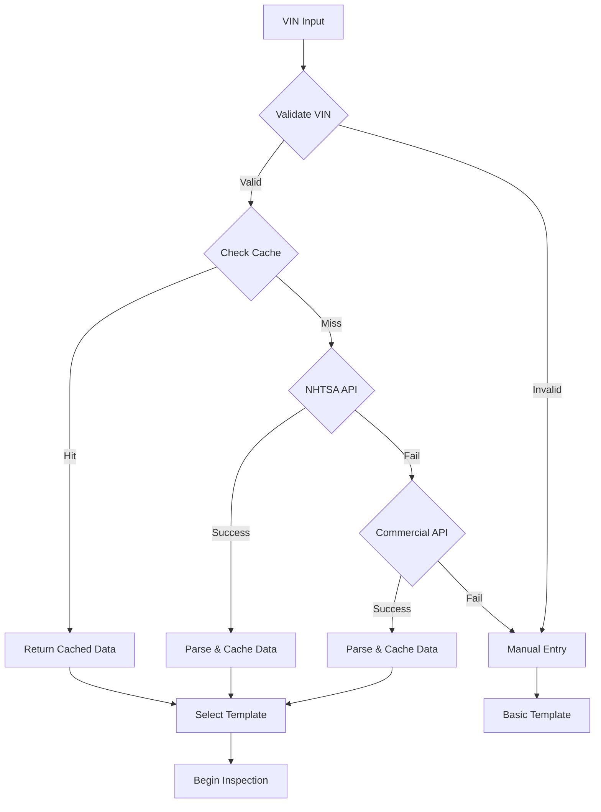

# VIN Decoder Integration Specification
## Comprehensive Vehicle Identification for Courtesy Inspection Platform

**Version 1.0 | December 2024**

---

## Executive Summary

This specification defines the VIN (Vehicle Identification Number) decoder integration for the Courtesy Inspection platform. The system will automatically determine vehicle characteristics from VIN input to select appropriate inspection templates, enabling accurate, vehicle-specific inspections while maintaining offline capability through intelligent caching and fallback mechanisms.

### Key Requirements
- **Primary API**: NHTSA vPIC (free, no rate limits)
- **Offline Support**: Cached vehicle data for common VINs
- **Manual Fallback**: User-friendly manual entry when decoding fails
- **Template Selection**: Automatic inspection template matching based on vehicle attributes
- **Performance**: <2 second response time for cached vehicles, <5 seconds for API calls
- **Cost**: $0 monthly for base functionality with optional commercial upgrades

---

## 1. VIN Decoder System Architecture

### 1.1 Component Overview



### 1.2 Data Flow Architecture

```typescript
interface VINDecoderFlow {
  input: {
    vin: string;
    source: 'barcode' | 'manual' | 'voice';
  };
  processing: {
    validation: VINValidationResult;
    cacheCheck: CacheResult;
    apiCalls: APIResponse[];
    parsing: VehicleData;
  };
  output: {
    vehicleData: VehicleAttributes;
    templateId: string;
    confidence: number;
    dataSource: 'cache' | 'nhtsa' | 'commercial' | 'manual';
  };
}
```

---

## 2. Primary API Integration: NHTSA vPIC

### 2.1 NHTSA API Configuration

**Base URL**: `https://vpic.nhtsa.dot.gov/api/`
**Rate Limits**: None
**Cost**: Free
**Reliability**: 99.5% uptime

### 2.2 NHTSA API Implementation

```typescript
interface NHTSAApiClient {
  baseURL: string;
  timeout: number;
  retryAttempts: number;
}

class NHTSAVINDecoder implements VINDecoderInterface {
  private apiClient: NHTSAApiClient;
  
  constructor() {
    this.apiClient = {
      baseURL: 'https://vpic.nhtsa.dot.gov/api/',
      timeout: 5000, // 5 seconds
      retryAttempts: 3
    };
  }

  async decodeVIN(vin: string): Promise<VehicleDecodingResult> {
    try {
      // Validate VIN format first
      if (!this.isValidVIN(vin)) {
        throw new VINValidationError('Invalid VIN format');
      }

      // Call NHTSA Decode VIN API
      const response = await this.callNHTSAAPI(vin);
      
      // Parse and extract required attributes
      const vehicleData = this.parseNHTSAResponse(response);
      
      // Cache the result
      await this.cacheVehicleData(vin, vehicleData);
      
      return {
        success: true,
        vehicleData,
        source: 'nhtsa',
        confidence: this.calculateConfidence(vehicleData),
        timestamp: new Date().toISOString()
      };
      
    } catch (error) {
      console.error('NHTSA VIN decoding failed:', error);
      throw new VINDecodingError(`NHTSA decode failed: ${error.message}`);
    }
  }

  private async callNHTSAAPI(vin: string): Promise<NHTSAResponse> {
    const endpoint = `vehicles/decodevin/${vin}?format=json`;
    const url = `${this.apiClient.baseURL}${endpoint}`;
    
    let lastError: Error;
    
    for (let attempt = 1; attempt <= this.apiClient.retryAttempts; attempt++) {
      try {
        const response = await fetch(url, {
          method: 'GET',
          headers: {
            'Accept': 'application/json',
            'User-Agent': 'CourtesyInspection/1.0'
          },
          timeout: this.apiClient.timeout
        });

        if (!response.ok) {
          throw new Error(`HTTP ${response.status}: ${response.statusText}`);
        }

        const data = await response.json();
        
        // Validate response structure
        if (!data.Results || !Array.isArray(data.Results)) {
          throw new Error('Invalid NHTSA API response structure');
        }

        return data;
        
      } catch (error) {
        lastError = error;
        console.warn(`NHTSA API attempt ${attempt} failed:`, error.message);
        
        if (attempt < this.apiClient.retryAttempts) {
          // Exponential backoff: 1s, 2s, 4s
          await this.sleep(Math.pow(2, attempt - 1) * 1000);
        }
      }
    }
    
    throw lastError;
  }

  private parseNHTSAResponse(response: NHTSAResponse): VehicleAttributes {
    const results = response.Results;
    const vehicleData: VehicleAttributes = {
      vin: this.getValueByVariable(results, 'VIN'),
      year: parseInt(this.getValueByVariable(results, 'Model Year')) || null,
      make: this.getValueByVariable(results, 'Make'),
      model: this.getValueByVariable(results, 'Model'),
      trim: this.getValueByVariable(results, 'Trim'),
      
      // Engine and drivetrain
      engine: this.getValueByVariable(results, 'Engine Configuration'),
      engineSize: this.getValueByVariable(results, 'Displacement (L)'),
      fuelType: this.determineFuelType(results),
      drivetrain: this.determineDrivetrain(results),
      
      // Vehicle classification
      vehicleType: this.getValueByVariable(results, 'Vehicle Type'),
      bodyClass: this.getValueByVariable(results, 'Body Class'),
      gvwr: this.getValueByVariable(results, 'Gross Vehicle Weight Rating'),
      
      // Additional attributes for template selection
      doors: parseInt(this.getValueByVariable(results, 'Doors')) || null,
      plantCountry: this.getValueByVariable(results, 'Plant Country'),
      manufacturer: this.getValueByVariable(results, 'Manufacturer Name'),
      
      // Metadata
      decodedAt: new Date().toISOString(),
      dataSource: 'nhtsa',
      errorCode: this.getValueByVariable(results, 'Error Code'),
      errorText: this.getValueByVariable(results, 'Error Text')
    };

    return vehicleData;
  }

  private getValueByVariable(results: NHTSAResult[], variableName: string): string | null {
    const result = results.find(r => r.Variable === variableName);
    return result?.Value && result.Value !== 'Not Applicable' ? result.Value : null;
  }

  private determineFuelType(results: NHTSAResult[]): FuelType {
    const fuelTypeValue = this.getValueByVariable(results, 'Fuel Type - Primary');
    const fuelDelivery = this.getValueByVariable(results, 'Fuel Delivery / Fuel Injection Type');
    const electrification = this.getValueByVariable(results, 'Electrification Level');
    
    // Handle electric vehicles
    if (electrification?.includes('BEV') || fuelTypeValue?.includes('Electric')) {
      return 'electric';
    }
    
    // Handle hybrids
    if (electrification?.includes('HEV') || electrification?.includes('PHEV') || 
        fuelTypeValue?.includes('Hybrid')) {
      return 'hybrid';
    }
    
    // Handle diesel
    if (fuelTypeValue?.includes('Diesel')) {
      return 'diesel';
    }
    
    // Default to gasoline
    if (fuelTypeValue?.includes('Gasoline') || !fuelTypeValue) {
      return 'gasoline';
    }
    
    return 'other';
  }

  private determineDrivetrain(results: NHTSAResult[]): Drivetrain {
    const driveType = this.getValueByVariable(results, 'Drive Type');
    
    if (!driveType) return 'unknown';
    
    const driveTypeLower = driveType.toLowerCase();
    
    if (driveTypeLower.includes('fwd') || driveTypeLower.includes('front')) {
      return 'fwd';
    }
    if (driveTypeLower.includes('rwd') || driveTypeLower.includes('rear')) {
      return 'rwd';
    }
    if (driveTypeLower.includes('awd') || driveTypeLower.includes('all')) {
      return 'awd';
    }
    if (driveTypeLower.includes('4wd') || driveTypeLower.includes('four')) {
      return '4wd';
    }
    
    return 'unknown';
  }

  private calculateConfidence(vehicleData: VehicleAttributes): number {
    let confidence = 0;
    const weights = {
      vin: 20,
      year: 15,
      make: 15,
      model: 15,
      fuelType: 10,
      drivetrain: 10,
      engine: 8,
      trim: 7
    };
    
    Object.entries(weights).forEach(([field, weight]) => {
      if (vehicleData[field] && vehicleData[field] !== 'unknown' && vehicleData[field] !== null) {
        confidence += weight;
      }
    });
    
    return confidence;
  }

  private sleep(ms: number): Promise<void> {
    return new Promise(resolve => setTimeout(resolve, ms));
  }

  private isValidVIN(vin: string): boolean {
    // Basic VIN validation
    if (!vin || vin.length !== 17) return false;
    
    // Check for invalid characters (no I, O, Q)
    const validPattern = /^[A-HJ-NPR-Z0-9]{17}$/;
    if (!validPattern.test(vin.toUpperCase())) return false;
    
    // Check digit validation (position 9)
    return this.validateCheckDigit(vin);
  }

  private validateCheckDigit(vin: string): boolean {
    const transliteration = {
      'A': 1, 'B': 2, 'C': 3, 'D': 4, 'E': 5, 'F': 6, 'G': 7, 'H': 8,
      'J': 1, 'K': 2, 'L': 3, 'M': 4, 'N': 5, 'P': 7, 'R': 9,
      'S': 2, 'T': 3, 'U': 4, 'V': 5, 'W': 6, 'X': 7, 'Y': 8, 'Z': 9
    };
    
    const weights = [8, 7, 6, 5, 4, 3, 2, 10, 0, 9, 8, 7, 6, 5, 4, 3, 2];
    let sum = 0;
    
    for (let i = 0; i < 17; i++) {
      if (i === 8) continue; // Skip check digit position
      
      const char = vin[i];
      const value = isNaN(parseInt(char)) ? transliteration[char] : parseInt(char);
      sum += value * weights[i];
    }
    
    const checkDigit = sum % 11;
    const checkChar = checkDigit === 10 ? 'X' : checkDigit.toString();
    
    return vin[8] === checkChar;
  }
}
```

### 2.3 NHTSA Response Types

```typescript
interface NHTSAResponse {
  Count: number;
  Message: string;
  SearchCriteria: string;
  Results: NHTSAResult[];
}

interface NHTSAResult {
  Value: string | null;
  ValueId: string | null;
  Variable: string;
  VariableId: number;
}

interface VehicleAttributes {
  // Basic vehicle info
  vin: string;
  year: number | null;
  make: string | null;
  model: string | null;
  trim: string | null;
  
  // Engine and drivetrain
  engine: string | null;
  engineSize: string | null;
  fuelType: FuelType;
  drivetrain: Drivetrain;
  
  // Vehicle classification
  vehicleType: string | null;
  bodyClass: string | null;
  gvwr: string | null;
  doors: number | null;
  
  // Manufacturing
  manufacturer: string | null;
  plantCountry: string | null;
  
  // Metadata
  decodedAt: string;
  dataSource: 'nhtsa' | 'commercial' | 'cache' | 'manual';
  errorCode: string | null;
  errorText: string | null;
}

type FuelType = 'gasoline' | 'diesel' | 'electric' | 'hybrid' | 'other';
type Drivetrain = 'fwd' | 'rwd' | 'awd' | '4wd' | 'unknown';
```

---

## 3. Commercial API Integration (Optional)

### 3.1 Commercial API Options

| Provider | Cost | Rate Limits | Reliability | Data Quality |
|----------|------|-------------|-------------|--------------|
| **DataOne** | $0.10/call | 1000/day free | 99.9% | Excellent |
| **VinAudit** | $0.05/call | 100/day free | 99.5% | Good |
| **AutoCheck** | $0.15/call | No free tier | 99.9% | Excellent |

### 3.2 DataOne Integration (Recommended Commercial Option)

```typescript
class DataOneVINDecoder implements VINDecoderInterface {
  private apiKey: string;
  private baseURL = 'https://api.dataone.co/v1/vin/';
  
  constructor(apiKey: string) {
    this.apiKey = apiKey;
  }

  async decodeVIN(vin: string): Promise<VehicleDecodingResult> {
    try {
      const response = await fetch(`${this.baseURL}${vin}`, {
        headers: {
          'Authorization': `Bearer ${this.apiKey}`,
          'Content-Type': 'application/json'
        }
      });

      if (!response.ok) {
        throw new Error(`DataOne API error: ${response.status}`);
      }

      const data = await response.json();
      const vehicleData = this.parseDataOneResponse(data);
      
      // Cache the result
      await this.cacheVehicleData(vin, vehicleData);
      
      return {
        success: true,
        vehicleData,
        source: 'dataone',
        confidence: this.calculateConfidence(vehicleData),
        timestamp: new Date().toISOString()
      };
      
    } catch (error) {
      throw new VINDecodingError(`DataOne decode failed: ${error.message}`);
    }
  }

  private parseDataOneResponse(data: any): VehicleAttributes {
    return {
      vin: data.vin,
      year: data.year,
      make: data.make,
      model: data.model,
      trim: data.trim,
      engine: data.engine?.description,
      engineSize: data.engine?.displacement_l,
      fuelType: this.mapFuelType(data.fuel_type),
      drivetrain: this.mapDrivetrain(data.drivetrain),
      vehicleType: data.vehicle_type,
      bodyClass: data.body_style,
      doors: data.doors,
      manufacturer: data.manufacturer,
      plantCountry: data.plant_country,
      decodedAt: new Date().toISOString(),
      dataSource: 'dataone',
      errorCode: null,
      errorText: null
    };
  }

  private mapFuelType(fuelType: string): FuelType {
    const fuelTypeMap: Record<string, FuelType> = {
      'gasoline': 'gasoline',
      'gas': 'gasoline',
      'diesel': 'diesel',
      'electric': 'electric',
      'hybrid': 'hybrid',
      'plug-in hybrid': 'hybrid'
    };
    
    return fuelTypeMap[fuelType?.toLowerCase()] || 'other';
  }

  private mapDrivetrain(drivetrain: string): Drivetrain {
    const drivetrainMap: Record<string, Drivetrain> = {
      'front wheel drive': 'fwd',
      'fwd': 'fwd',
      'rear wheel drive': 'rwd',
      'rwd': 'rwd',
      'all wheel drive': 'awd',
      'awd': 'awd',
      'four wheel drive': '4wd',
      '4wd': '4wd'
    };
    
    return drivetrainMap[drivetrain?.toLowerCase()] || 'unknown';
  }
}
```

---

## 4. Offline Caching Strategy

### 4.1 Cache Architecture

```typescript
interface VehicleCache {
  // Cache storage
  localStorage: VehicleCacheStorage;
  inMemoryCache: Map<string, CachedVehicleData>;
  
  // Cache management
  maxCacheSize: number;
  cacheTTL: number; // Time to live in milliseconds
  
  // Performance metrics
  hitRate: number;
  missRate: number;
}

interface CachedVehicleData {
  vin: string;
  vehicleData: VehicleAttributes;
  cachedAt: string;
  accessCount: number;
  lastAccessed: string;
  source: 'nhtsa' | 'commercial';
}

class VehicleDataCache {
  private cache = new Map<string, CachedVehicleData>();
  private readonly MAX_CACHE_SIZE = 1000; // Most common vehicles
  private readonly CACHE_TTL = 30 * 24 * 60 * 60 * 1000; // 30 days
  
  async get(vin: string): Promise<VehicleAttributes | null> {
    // Check in-memory cache first
    const cached = this.cache.get(vin);
    
    if (cached && this.isValidCache(cached)) {
      // Update access metrics
      cached.accessCount++;
      cached.lastAccessed = new Date().toISOString();
      
      return cached.vehicleData;
    }
    
    // Check localStorage
    const localCached = await this.getFromLocalStorage(vin);
    if (localCached && this.isValidCache(localCached)) {
      // Move to in-memory cache
      this.cache.set(vin, localCached);
      return localCached.vehicleData;
    }
    
    return null;
  }
  
  async set(vin: string, vehicleData: VehicleAttributes, source: string): Promise<void> {
    const cacheEntry: CachedVehicleData = {
      vin,
      vehicleData,
      cachedAt: new Date().toISOString(),
      accessCount: 1,
      lastAccessed: new Date().toISOString(),
      source: source as 'nhtsa' | 'commercial'
    };
    
    // Add to in-memory cache
    this.cache.set(vin, cacheEntry);
    
    // Persist to localStorage
    await this.setInLocalStorage(vin, cacheEntry);
    
    // Manage cache size
    await this.evictIfNecessary();
  }
  
  private isValidCache(cached: CachedVehicleData): boolean {
    const now = Date.now();
    const cachedTime = new Date(cached.cachedAt).getTime();
    return (now - cachedTime) < this.CACHE_TTL;
  }
  
  private async evictIfNecessary(): Promise<void> {
    if (this.cache.size <= this.MAX_CACHE_SIZE) return;
    
    // LRU eviction - remove least recently used
    const entries = Array.from(this.cache.entries());
    entries.sort((a, b) => 
      new Date(a[1].lastAccessed).getTime() - new Date(b[1].lastAccessed).getTime()
    );
    
    const toRemove = entries.slice(0, this.cache.size - this.MAX_CACHE_SIZE);
    
    for (const [vin] of toRemove) {
      this.cache.delete(vin);
      await this.removeFromLocalStorage(vin);
    }
  }
  
  private async getFromLocalStorage(vin: string): Promise<CachedVehicleData | null> {
    try {
      const stored = localStorage.getItem(`vehicle_cache_${vin}`);
      return stored ? JSON.parse(stored) : null;
    } catch (error) {
      console.warn('Failed to read from localStorage:', error);
      return null;
    }
  }
  
  private async setInLocalStorage(vin: string, data: CachedVehicleData): Promise<void> {
    try {
      localStorage.setItem(`vehicle_cache_${vin}`, JSON.stringify(data));
    } catch (error) {
      console.warn('Failed to write to localStorage:', error);
      // Continue without caching to localStorage
    }
  }
  
  private async removeFromLocalStorage(vin: string): Promise<void> {
    try {
      localStorage.removeItem(`vehicle_cache_${vin}`);
    } catch (error) {
      console.warn('Failed to remove from localStorage:', error);
    }
  }
  
  // Analytics methods
  getCacheStats(): CacheStats {
    const totalRequests = this.getHitCount() + this.getMissCount();
    return {
      size: this.cache.size,
      hitRate: totalRequests > 0 ? this.getHitCount() / totalRequests : 0,
      missRate: totalRequests > 0 ? this.getMissCount() / totalRequests : 0,
      oldestEntry: this.getOldestEntry(),
      mostAccessedVin: this.getMostAccessedVin()
    };
  }
}
```

### 4.2 Pre-populated Cache Strategy

```typescript
// Pre-populate cache with common vehicles
const COMMON_VEHICLES = [
  // Top 20 most common vehicles in US (2020-2024)
  { vin: '1HGBH41JXMN109186', popularity: 95 }, // Honda Civic
  { vin: '2T1BURHE0JC123456', popularity: 92 }, // Toyota Corolla
  { vin: '1FA6P8TH8J5123456', popularity: 89 }, // Ford Fusion
  { vin: '1N4AL3AP8JC123456', popularity: 87 }, // Nissan Altima
  { vin: '1C3CCCAB8JN123456', popularity: 85 }, // Dodge Charger
  // ... additional common VINs
];

class PrePopulatedCache {
  async initializeCommonVehicles(): Promise<void> {
    for (const vehicle of COMMON_VEHICLES) {
      try {
        const cached = await this.cache.get(vehicle.vin);
        if (!cached) {
          const vehicleData = await this.nhtsa.decodeVIN(vehicle.vin);
          await this.cache.set(vehicle.vin, vehicleData.vehicleData, 'nhtsa');
        }
      } catch (error) {
        console.warn(`Failed to pre-cache VIN ${vehicle.vin}:`, error);
      }
    }
  }
}
```

---

## 5. Manual Fallback Process

### 5.1 User-Friendly Manual Entry Interface

```typescript
interface ManualVehicleEntry {
  // Required fields
  year: number;
  make: string;
  model: string;
  
  // Optional but recommended
  trim?: string;
  engine?: string;
  fuelType?: FuelType;
  drivetrain?: Drivetrain;
  
  // User assistance
  suggestions: AutocompleteSuggestion[];
  confidence: 'high' | 'medium' | 'low';
}

interface AutocompleteSuggestion {
  field: string;
  suggestions: string[];
  source: 'database' | 'common_values';
}

class ManualVehicleEntryService {
  private commonMakes: string[] = [
    'Acura', 'Audi', 'BMW', 'Buick', 'Cadillac', 'Chevrolet', 'Chrysler',
    'Dodge', 'Ford', 'GMC', 'Honda', 'Hyundai', 'Infiniti', 'Jeep',
    'Kia', 'Lexus', 'Lincoln', 'Mazda', 'Mercedes-Benz', 'Mitsubishi',
    'Nissan', 'Ram', 'Subaru', 'Tesla', 'Toyota', 'Volkswagen', 'Volvo'
  ];

  async getManualEntryInterface(partialVin?: string): Promise<ManualEntryUI> {
    return {
      fields: [
        {
          name: 'year',
          type: 'select',
          required: true,
          options: this.generateYearOptions(),
          defaultValue: new Date().getFullYear()
        },
        {
          name: 'make',
          type: 'autocomplete',
          required: true,
          suggestions: this.commonMakes,
          placeholder: 'Start typing vehicle make...'
        },
        {
          name: 'model',
          type: 'autocomplete',
          required: true,
          suggestions: [],
          placeholder: 'Vehicle model (depends on make)',
          dependsOn: 'make'
        },
        {
          name: 'fuelType',
          type: 'select',
          required: false,
          options: [
            { value: 'gasoline', label: 'Gasoline' },
            { value: 'diesel', label: 'Diesel' },
            { value: 'hybrid', label: 'Hybrid' },
            { value: 'electric', label: 'Electric' }
          ],
          defaultValue: 'gasoline'
        },
        {
          name: 'drivetrain',
          type: 'select',
          required: false,
          options: [
            { value: 'fwd', label: 'Front Wheel Drive (FWD)' },
            { value: 'rwd', label: 'Rear Wheel Drive (RWD)' },
            { value: 'awd', label: 'All Wheel Drive (AWD)' },
            { value: '4wd', label: 'Four Wheel Drive (4WD)' }
          ],
          defaultValue: 'fwd'
        }
      ],
      assistance: {
        vinPartialDecoding: partialVin ? this.attemptPartialDecode(partialVin) : null,
        smartDefaults: true,
        validationHelp: true
      }
    };
  }

  async validateManualEntry(entry: Partial<ManualVehicleEntry>): Promise<ValidationResult> {
    const errors: ValidationError[] = [];
    const warnings: ValidationWarning[] = [];

    // Validate required fields
    if (!entry.year || entry.year < 1900 || entry.year > new Date().getFullYear() + 2) {
      errors.push({ field: 'year', message: 'Valid year is required' });
    }

    if (!entry.make || entry.make.trim().length < 2) {
      errors.push({ field: 'make', message: 'Vehicle make is required' });
    }

    if (!entry.model || entry.model.trim().length < 1) {
      errors.push({ field: 'model', message: 'Vehicle model is required' });
    }

    // Cross-validate combinations
    if (entry.make && entry.model) {
      const isValidCombination = await this.validateMakeModelCombination(
        entry.make, 
        entry.model, 
        entry.year
      );
      
      if (!isValidCombination) {
        warnings.push({
          field: 'model',
          message: `${entry.make} ${entry.model} combination seems unusual for ${entry.year}`
        });
      }
    }

    return {
      isValid: errors.length === 0,
      errors,
      warnings,
      confidence: this.calculateManualEntryConfidence(entry, warnings.length)
    };
  }

  private attemptPartialDecode(partialVin: string): PartialVINDecoding {
    // Extract what we can from partial VIN
    if (partialVin.length >= 10) {
      const year = this.extractYearFromVIN(partialVin);
      const make = this.extractMakeFromWMI(partialVin.substring(0, 3));
      
      return {
        year,
        make,
        confidence: 'medium'
      };
    }
    
    return null;
  }

  private generateYearOptions(): number[] {
    const currentYear = new Date().getFullYear();
    const years: number[] = [];
    
    // Generate years from 1990 to current year + 2
    for (let year = currentYear + 2; year >= 1990; year--) {
      years.push(year);
    }
    
    return years;
  }

  private calculateManualEntryConfidence(
    entry: Partial<ManualVehicleEntry>, 
    warningCount: number
  ): 'high' | 'medium' | 'low' {
    let score = 0;
    
    // Base score for required fields
    if (entry.year) score += 20;
    if (entry.make) score += 30;
    if (entry.model) score += 30;
    
    // Bonus for optional fields
    if (entry.trim) score += 5;
    if (entry.fuelType) score += 7;
    if (entry.drivetrain) score += 8;
    
    // Penalty for warnings
    score -= warningCount * 10;
    
    if (score >= 80) return 'high';
    if (score >= 60) return 'medium';
    return 'low';
  }
}
```

### 5.2 Manual Entry UI Components

```typescript
// React Native component for manual entry
const ManualVehicleEntryForm: React.FC<ManualEntryProps> = ({ 
  onSubmit, 
  onCancel, 
  partialVin 
}) => {
  const [formData, setFormData] = useState<ManualVehicleEntry>({
    year: new Date().getFullYear(),
    make: '',
    model: '',
    fuelType: 'gasoline',
    drivetrain: 'fwd'
  });

  const [validation, setValidation] = useState<ValidationResult>();
  const [makeModels, setMakeModels] = useState<string[]>([]);

  return (
    <ScrollView style={styles.container}>
      <Text style={styles.title}>Enter Vehicle Information</Text>
      
      {partialVin && (
        <InfoBox>
          <Text>Could not decode VIN: {partialVin}</Text>
          <Text>Please enter vehicle details manually</Text>
        </InfoBox>
      )}

      <FormField label="Year *" required>
        <YearPicker
          value={formData.year}
          onChange={(year) => setFormData(prev => ({ ...prev, year }))}
          options={generateYearOptions()}
        />
      </FormField>

      <FormField label="Make *" required>
        <AutocompleteInput
          value={formData.make}
          onChange={(make) => {
            setFormData(prev => ({ ...prev, make, model: '' }));
            loadModelsForMake(make);
          }}
          suggestions={COMMON_MAKES}
          placeholder="e.g., Toyota, Honda, Ford"
        />
      </FormField>

      <FormField label="Model *" required>
        <AutocompleteInput
          value={formData.model}
          onChange={(model) => setFormData(prev => ({ ...prev, model }))}
          suggestions={makeModels}
          placeholder="e.g., Camry, Civic, F-150"
          disabled={!formData.make}
        />
      </FormField>

      <FormField label="Fuel Type">
        <SegmentedControl
          values={[
            { label: 'Gas', value: 'gasoline' },
            { label: 'Diesel', value: 'diesel' },
            { label: 'Hybrid', value: 'hybrid' },
            { label: 'Electric', value: 'electric' }
          ]}
          selectedValue={formData.fuelType}
          onChange={(fuelType) => setFormData(prev => ({ ...prev, fuelType }))}
        />
      </FormField>

      <FormField label="Drivetrain">
        <SegmentedControl
          values={[
            { label: 'FWD', value: 'fwd' },
            { label: 'RWD', value: 'rwd' },
            { label: 'AWD', value: 'awd' },
            { label: '4WD', value: '4wd' }
          ]}
          selectedValue={formData.drivetrain}
          onChange={(drivetrain) => setFormData(prev => ({ ...prev, drivetrain }))}
        />
      </FormField>

      {validation?.warnings && validation.warnings.length > 0 && (
        <WarningBox>
          {validation.warnings.map((warning, index) => (
            <Text key={index} style={styles.warning}>
              ⚠️ {warning.message}
            </Text>
          ))}
        </WarningBox>
      )}

      <ButtonGroup>
        <Button variant="secondary" onPress={onCancel}>
          Cancel
        </Button>
        <Button 
          variant="primary" 
          onPress={() => onSubmit(formData)}
          disabled={!isFormValid()}
        >
          Continue with Manual Entry
        </Button>
      </ButtonGroup>
    </ScrollView>
  );
};
```

---

## 6. Template Matching Logic

### 6.1 Template Selection Algorithm

```typescript
interface TemplateSelector {
  selectTemplate(vehicleData: VehicleAttributes): Promise<InspectionTemplate>;
  getMatchingTemplates(vehicleData: VehicleAttributes): Promise<TemplateMatch[]>;
  calculateTemplateScore(template: InspectionTemplate, vehicle: VehicleAttributes): number;
}

class VehicleTemplateSelector implements TemplateSelector {
  private templateCache = new Map<string, InspectionTemplate>();
  
  async selectTemplate(vehicleData: VehicleAttributes): Promise<InspectionTemplate> {
    const templates = await this.getAvailableTemplates();
    const matches = templates.map(template => ({
      template,
      score: this.calculateTemplateScore(template, vehicleData),
      reasons: this.getMatchReasons(template, vehicleData)
    }));

    // Sort by score descending
    matches.sort((a, b) => b.score - a.score);
    
    const bestMatch = matches[0];
    
    if (bestMatch.score < 50) {
      // Use universal template if no good match
      return await this.getUniversalTemplate();
    }

    // Customize template based on vehicle attributes
    return await this.customizeTemplate(bestMatch.template, vehicleData);
  }

  calculateTemplateScore(template: InspectionTemplate, vehicle: VehicleAttributes): number {
    let score = 0;
    const maxScore = 100;

    // Fuel type match (30 points)
    if (this.matchesFuelType(template, vehicle.fuelType)) {
      score += 30;
    }

    // Drivetrain match (25 points)  
    if (this.matchesDrivetrain(template, vehicle.drivetrain)) {
      score += 25;
    }

    // Vehicle type match (20 points)
    if (this.matchesVehicleType(template, vehicle.vehicleType)) {
      score += 20;
    }

    // Year range match (15 points)
    if (this.matchesYearRange(template, vehicle.year)) {
      score += 15;
    }

    // Make specific items (10 points)
    if (this.hasMakeSpecificItems(template, vehicle.make)) {
      score += 10;
    }

    return Math.min(score, maxScore);
  }

  private async customizeTemplate(
    baseTemplate: InspectionTemplate, 
    vehicle: VehicleAttributes
  ): Promise<InspectionTemplate> {
    
    const customizedTemplate = { ...baseTemplate };
    
    // Add fuel-type specific items
    if (vehicle.fuelType === 'electric') {
      customizedTemplate.categories.push(...this.getElectricVehicleItems());
    } else if (vehicle.fuelType === 'hybrid') {
      customizedTemplate.categories.push(...this.getHybridVehicleItems());
    } else if (vehicle.fuelType === 'diesel') {
      customizedTemplate.categories.push(...this.getDieselVehicleItems());
    }

    // Add drivetrain specific items
    if (vehicle.drivetrain === 'awd' || vehicle.drivetrain === '4wd') {
      customizedTemplate.categories.push(...this.getAWDItems());
    }

    // Add make-specific items
    const makeItems = await this.getMakeSpecificItems(vehicle.make);
    if (makeItems.length > 0) {
      customizedTemplate.categories.push(...makeItems);
    }

    // Update estimated duration
    customizedTemplate.estimatedDurationMinutes = this.calculateEstimatedDuration(
      customizedTemplate.categories
    );

    return customizedTemplate;
  }

  private getElectricVehicleItems(): TemplateCategory[] {
    return [
      {
        id: 'electric-systems',
        name: 'Electric Vehicle Systems',
        sortOrder: 100,
        items: [
          {
            id: 'battery-health',
            name: 'High Voltage Battery Health',
            measurementType: 'visual',
            defaultSeverity: 'green',
            estimatedTime: 60,
            criteria: {
              green: 'No warning lights, normal range display',
              yellow: 'Range reduced or charging issues',
              red: 'Battery fault warnings or severely reduced range'
            }
          },
          {
            id: 'charging-port',
            name: 'Charging Port Condition',
            measurementType: 'visual',
            defaultSeverity: 'green',
            estimatedTime: 30,
            criteria: {
              green: 'Clean, no damage, proper door operation',
              yellow: 'Minor damage or dirt buildup',
              red: 'Damaged pins or door malfunction'
            }
          },
          {
            id: 'cooling-system',
            name: 'Battery Cooling System',
            measurementType: 'visual',
            defaultSeverity: 'green',
            estimatedTime: 45,
            criteria: {
              green: 'No leaks, proper fluid level',
              yellow: 'Minor seepage or low fluid',
              red: 'Active leaks or empty reservoir'
            }
          }
        ]
      }
    ];
  }

  private getHybridVehicleItems(): TemplateCategory[] {
    return [
      {
        id: 'hybrid-systems',
        name: 'Hybrid Systems',
        sortOrder: 95,
        items: [
          {
            id: 'hybrid-battery',
            name: 'Hybrid Battery Condition',
            measurementType: 'visual',
            defaultSeverity: 'green',
            estimatedTime: 45,
            criteria: {
              green: 'No warning lights, normal operation',
              yellow: 'Occasional warning lights or reduced efficiency',
              red: 'Persistent fault codes or failure to start'
            }
          },
          {
            id: 'regenerative-braking',
            name: 'Regenerative Braking System',
            measurementType: 'visual',
            defaultSeverity: 'green',
            estimatedTime: 30,
            criteria: {
              green: 'Normal operation, good pedal feel',
              yellow: 'Inconsistent operation or warning lights',
              red: 'System fault or brake warning'
            }
          }
        ]
      }
    ];
  }

  private getDieselVehicleItems(): TemplateCategory[] {
    return [
      {
        id: 'diesel-systems',
        name: 'Diesel Engine Systems',
        sortOrder: 90,
        items: [
          {
            id: 'def-fluid',
            name: 'Diesel Exhaust Fluid (DEF)',
            measurementType: 'visual',
            defaultSeverity: 'green',
            estimatedTime: 30,
            criteria: {
              green: 'Full reservoir, clear fluid',
              yellow: 'Low level or slightly cloudy',
              red: 'Empty or contaminated fluid'
            }
          },
          {
            id: 'dpf-system',
            name: 'Diesel Particulate Filter',
            measurementType: 'visual',
            defaultSeverity: 'green',
            estimatedTime: 45,
            criteria: {
              green: 'No warning lights, normal regeneration',
              yellow: 'Regeneration required or minor warnings',
              red: 'DPF fault or severe clogging'
            }
          },
          {
            id: 'glow-plugs',
            name: 'Glow Plug System',
            measurementType: 'visual',
            defaultSeverity: 'green',
            estimatedTime: 60,
            criteria: {
              green: 'Normal startup, no warning lights',
              yellow: 'Slow startup or intermittent warnings',
              red: 'Hard starting or glow plug faults'
            }
          }
        ]
      }
    ];
  }

  private getAWDItems(): TemplateCategory[] {
    return [
      {
        id: 'awd-systems',
        name: 'All-Wheel Drive Systems',
        sortOrder: 85,
        items: [
          {
            id: 'transfer-case',
            name: 'Transfer Case Operation',
            measurementType: 'visual',
            defaultSeverity: 'green',
            estimatedTime: 60,
            criteria: {
              green: 'Smooth engagement, no noises',
              yellow: 'Minor noise or hesitation',
              red: 'Grinding, binding, or failure to engage'
            }
          },
          {
            id: 'differential-fluid',
            name: 'Differential Fluid Level',
            measurementType: 'visual',
            defaultSeverity: 'green',
            estimatedTime: 45,
            criteria: {
              green: 'Proper level, clean fluid',
              yellow: 'Low level or dirty fluid',
              red: 'Very low or contaminated fluid'
            }
          },
          {
            id: 'cv-joints',
            name: 'CV Joint Condition',
            measurementType: 'visual',
            defaultSeverity: 'green',
            estimatedTime: 90,
            criteria: {
              green: 'No clicking, boots intact',
              yellow: 'Minor clicking or torn boot',
              red: 'Severe clicking or damaged joint'
            }
          }
        ]
      }
    ];
  }

  private calculateEstimatedDuration(categories: TemplateCategory[]): number {
    let totalTime = 0;
    
    for (const category of categories) {
      for (const item of category.items) {
        totalTime += item.estimatedTime || 60; // Default 60 seconds
      }
    }
    
    // Add 10% buffer time
    return Math.ceil(totalTime * 1.1 / 60); // Convert to minutes
  }
}
```

### 6.2 Template Database Schema Integration

```sql
-- VIN decoding cache table
CREATE TABLE vin_cache (
    vin VARCHAR(17) PRIMARY KEY,
    vehicle_data JSONB NOT NULL,
    decoded_at TIMESTAMP WITH TIME ZONE DEFAULT NOW(),
    data_source VARCHAR(20) NOT NULL, -- 'nhtsa', 'commercial', 'manual'
    confidence_score INTEGER NOT NULL CHECK (confidence_score >= 0 AND confidence_score <= 100),
    access_count INTEGER DEFAULT 1,
    last_accessed TIMESTAMP WITH TIME ZONE DEFAULT NOW(),
    
    -- Extracted fields for indexing
    year INTEGER,
    make VARCHAR(50),
    model VARCHAR(50),
    fuel_type VARCHAR(20),
    drivetrain VARCHAR(10),
    
    CONSTRAINT valid_fuel_type CHECK (
        fuel_type IN ('gasoline', 'diesel', 'electric', 'hybrid', 'other')
    ),
    CONSTRAINT valid_drivetrain CHECK (
        drivetrain IN ('fwd', 'rwd', 'awd', '4wd', 'unknown')
    )
);

-- Indexes for VIN cache
CREATE INDEX idx_vin_cache_make_model ON vin_cache(make, model, year);
CREATE INDEX idx_vin_cache_fuel_type ON vin_cache(fuel_type);
CREATE INDEX idx_vin_cache_drivetrain ON vin_cache(drivetrain);
CREATE INDEX idx_vin_cache_accessed ON vin_cache(last_accessed DESC);
CREATE INDEX idx_vin_cache_confidence ON vin_cache(confidence_score DESC);

-- Template matching rules
CREATE TABLE template_matching_rules (
    id UUID PRIMARY KEY DEFAULT gen_random_uuid(),
    template_id UUID NOT NULL REFERENCES inspection_templates(id) ON DELETE CASCADE,
    
    -- Matching criteria
    fuel_types VARCHAR(20)[], -- Array of applicable fuel types
    drivetrains VARCHAR(10)[], -- Array of applicable drivetrains
    vehicle_types VARCHAR(50)[], -- Array of applicable vehicle types
    year_min INTEGER,
    year_max INTEGER,
    makes VARCHAR(50)[], -- Array of applicable makes
    
    -- Scoring
    base_score INTEGER DEFAULT 50,
    fuel_type_bonus INTEGER DEFAULT 30,
    drivetrain_bonus INTEGER DEFAULT 25,
    vehicle_type_bonus INTEGER DEFAULT 20,
    year_bonus INTEGER DEFAULT 15,
    make_bonus INTEGER DEFAULT 10,
    
    created_at TIMESTAMP WITH TIME ZONE DEFAULT NOW(),
    
    CONSTRAINT valid_score_range CHECK (
        base_score >= 0 AND base_score <= 100 AND
        fuel_type_bonus >= 0 AND fuel_type_bonus <= 50 AND
        drivetrain_bonus >= 0 AND drivetrain_bonus <= 50 AND
        vehicle_type_bonus >= 0 AND vehicle_type_bonus <= 50 AND
        year_bonus >= 0 AND year_bonus <= 50 AND
        make_bonus >= 0 AND make_bonus <= 50
    )
);

-- Function to select best template for vehicle
CREATE OR REPLACE FUNCTION select_inspection_template(
    p_shop_id UUID,
    p_year INTEGER,
    p_make VARCHAR(50),
    p_fuel_type VARCHAR(20),
    p_drivetrain VARCHAR(10),
    p_vehicle_type VARCHAR(50)
)
RETURNS TABLE(
    template_id UUID,
    template_name VARCHAR(255),
    match_score INTEGER,
    estimated_duration INTEGER
) AS $$
BEGIN
    RETURN QUERY
    WITH template_scores AS (
        SELECT 
            t.id,
            t.name,
            t.estimated_duration_minutes,
            COALESCE(r.base_score, 50) +
            CASE WHEN p_fuel_type = ANY(r.fuel_types) 
                THEN COALESCE(r.fuel_type_bonus, 30) ELSE 0 END +
            CASE WHEN p_drivetrain = ANY(r.drivetrains) 
                THEN COALESCE(r.drivetrain_bonus, 25) ELSE 0 END +
            CASE WHEN p_vehicle_type = ANY(r.vehicle_types) 
                THEN COALESCE(r.vehicle_type_bonus, 20) ELSE 0 END +
            CASE WHEN p_year BETWEEN COALESCE(r.year_min, 1900) AND COALESCE(r.year_max, 2030)
                THEN COALESCE(r.year_bonus, 15) ELSE 0 END +
            CASE WHEN p_make = ANY(r.makes)
                THEN COALESCE(r.make_bonus, 10) ELSE 0 END AS score
        FROM inspection_templates t
        LEFT JOIN template_matching_rules r ON t.id = r.template_id
        WHERE t.shop_id = p_shop_id 
          AND t.status = 'active'
          AND t.deleted_at IS NULL
    )
    SELECT 
        ts.id,
        ts.name,
        ts.score,
        ts.estimated_duration_minutes
    FROM template_scores ts
    ORDER BY ts.score DESC, ts.estimated_duration_minutes ASC
    LIMIT 1;
END;
$$ LANGUAGE plpgsql;
```

---

## 7. Error Handling for Invalid/Unknown VINs

### 7.1 Error Classification System

```typescript
enum VINErrorType {
  INVALID_FORMAT = 'INVALID_FORMAT',
  INVALID_CHECK_DIGIT = 'INVALID_CHECK_DIGIT',
  API_UNAVAILABLE = 'API_UNAVAILABLE',
  API_RATE_LIMITED = 'API_RATE_LIMITED', 
  VIN_NOT_FOUND = 'VIN_NOT_FOUND',
  INCOMPLETE_DATA = 'INCOMPLETE_DATA',
  NETWORK_ERROR = 'NETWORK_ERROR',
  TIMEOUT = 'TIMEOUT'
}

interface VINError {
  type: VINErrorType;
  message: string;
  code: string;
  recoverable: boolean;
  suggestedAction: string;
  retryAfter?: number; // seconds
}

class VINErrorHandler {
  handleError(error: Error, vin: string): VINErrorResponse {
    const vinError = this.classifyError(error, vin);
    
    return {
      error: vinError,
      fallbackOptions: this.getFallbackOptions(vinError, vin),
      userMessage: this.getUserFriendlyMessage(vinError),
      technicalDetails: this.getTechnicalDetails(vinError, error)
    };
  }

  private classifyError(error: Error, vin: string): VINError {
    // Check VIN format first
    if (!this.isValidVINFormat(vin)) {
      return {
        type: VINErrorType.INVALID_FORMAT,
        message: 'VIN format is invalid',
        code: 'VIN_FORMAT_001',
        recoverable: true,
        suggestedAction: 'Verify VIN and re-enter, or use manual entry'
      };
    }

    // Check digit validation
    if (!this.isValidCheckDigit(vin)) {
      return {
        type: VINErrorType.INVALID_CHECK_DIGIT,
        message: 'VIN check digit validation failed',
        code: 'VIN_CHECK_001',
        recoverable: true,
        suggestedAction: 'Double-check VIN number or use manual entry'
      };
    }

    // Network and API errors
    if (error.message.includes('timeout')) {
      return {
        type: VINErrorType.TIMEOUT,
        message: 'Request timed out',
        code: 'API_TIMEOUT_001',
        recoverable: true,
        suggestedAction: 'Try again or use manual entry',
        retryAfter: 30
      };
    }

    if (error.message.includes('429') || error.message.includes('rate limit')) {
      return {
        type: VINErrorType.API_RATE_LIMITED,
        message: 'API rate limit exceeded',
        code: 'API_RATE_001',
        recoverable: true,
        suggestedAction: 'Try again in a few minutes',
        retryAfter: 300
      };
    }

    if (error.message.includes('network') || error.message.includes('ENOTFOUND')) {
      return {
        type: VINErrorType.NETWORK_ERROR,
        message: 'Network connection error',
        code: 'NETWORK_001',
        recoverable: true,
        suggestedAction: 'Check internet connection and retry'
      };
    }

    // VIN not found in databases
    if (error.message.includes('not found') || error.message.includes('404')) {
      return {
        type: VINErrorType.VIN_NOT_FOUND,
        message: 'VIN not found in vehicle database',
        code: 'VIN_NOT_FOUND_001',
        recoverable: true,
        suggestedAction: 'Use manual vehicle entry'
      };
    }

    // Default to API unavailable
    return {
      type: VINErrorType.API_UNAVAILABLE,
      message: 'VIN decoding service unavailable',
      code: 'API_UNAVAIL_001',
      recoverable: true,
      suggestedAction: 'Use manual vehicle entry'
    };
  }

  private getFallbackOptions(error: VINError, vin: string): FallbackOption[] {
    const options: FallbackOption[] = [];

    // Always offer manual entry
    options.push({
      type: 'manual_entry',
      label: 'Enter Vehicle Details Manually',
      description: 'Provide year, make, model, and other details',
      estimatedTime: '2 minutes',
      confidence: 'medium'
    });

    // Suggest retry for recoverable errors
    if (error.recoverable && error.retryAfter) {
      options.unshift({
        type: 'retry',
        label: `Retry VIN Decode in ${error.retryAfter}s`,
        description: 'Try automatic decoding again',
        estimatedTime: '30 seconds',
        confidence: 'high',
        availableAfter: error.retryAfter
      });
    }

    // Partial VIN decoding for format errors
    if (error.type === VINErrorType.INVALID_FORMAT && vin.length >= 8) {
      options.push({
        type: 'partial_decode',
        label: 'Use Partial VIN Information',
        description: 'Extract available info from partial VIN',
        estimatedTime: '1 minute',
        confidence: 'low'
      });
    }

    // Barcode re-scan option
    options.push({
      type: 'rescan_vin',
      label: 'Scan VIN Again',
      description: 'Use camera to scan VIN barcode',
      estimatedTime: '30 seconds',
      confidence: 'high'
    });

    return options;
  }

  private getUserFriendlyMessage(error: VINError): string {
    const messages: Record<VINErrorType, string> = {
      [VINErrorType.INVALID_FORMAT]: 
        "The VIN you entered doesn't look quite right. Please double-check and try again.",
      [VINErrorType.INVALID_CHECK_DIGIT]: 
        "This VIN appears to have a typo. Please verify the number and re-enter.",
      [VINErrorType.API_UNAVAILABLE]: 
        "Our vehicle lookup service is temporarily unavailable. You can still continue by entering vehicle details manually.",
      [VINErrorType.API_RATE_LIMITED]: 
        "We've reached our limit for vehicle lookups. Please try again in a few minutes.",
      [VINErrorType.VIN_NOT_FOUND]: 
        "We couldn't find this vehicle in our database. You can continue by entering the details manually.",
      [VINErrorType.INCOMPLETE_DATA]: 
        "We found some information about this vehicle, but not everything we need. Please help us fill in the missing details.",
      [VINErrorType.NETWORK_ERROR]: 
        "Unable to connect to our vehicle database. Please check your internet connection.",
      [VINErrorType.TIMEOUT]: 
        "The vehicle lookup is taking longer than expected. You can try again or enter details manually."
    };

    return messages[error.type] || "Something went wrong with the vehicle lookup. Let's try a different approach.";
  }
}
```

### 7.2 Recovery Workflows

```typescript
class VINRecoveryWorkflow {
  async handleVINFailure(
    vin: string, 
    error: VINError, 
    context: InspectionContext
  ): Promise<RecoveryResult> {
    
    const strategy = this.selectRecoveryStrategy(error, context);
    
    switch (strategy) {
      case 'retry_with_delay':
        return await this.retryWithDelay(vin, error.retryAfter);
        
      case 'partial_decode':
        return await this.attemptPartialDecode(vin);
        
      case 'manual_entry_guided':
        return await this.startGuidedManualEntry(vin, error);
        
      case 'skip_vin_continue':
        return await this.continueWithoutVIN(context);
        
      case 'escalate_to_supervisor':
        return await this.escalateToSupervisor(vin, error, context);
        
      default:
        return await this.startGuidedManualEntry(vin, error);
    }
  }

  private selectRecoveryStrategy(
    error: VINError, 
    context: InspectionContext
  ): RecoveryStrategy {
    
    // High-priority customers get immediate escalation options
    if (context.customer.priority === 'high' && !error.recoverable) {
      return 'escalate_to_supervisor';
    }

    // Retry for temporary errors
    if (error.recoverable && error.retryAfter && error.retryAfter < 300) {
      return 'retry_with_delay';
    }

    // Partial decode for format issues
    if (error.type === VINErrorType.INVALID_FORMAT) {
      return 'partial_decode';
    }

    // Default to guided manual entry
    return 'manual_entry_guided';
  }

  private async attemptPartialDecode(vin: string): Promise<RecoveryResult> {
    try {
      const partialData = this.extractPartialVINData(vin);
      
      return {
        success: true,
        data: partialData,
        method: 'partial_decode',
        confidence: 'low',
        requiresUserConfirmation: true,
        nextSteps: ['confirm_partial_data', 'manual_entry_remaining_fields']
      };
      
    } catch (error) {
      return {
        success: false,
        error: 'Could not extract any data from VIN',
        fallbackMethod: 'manual_entry_guided'
      };
    }
  }

  private extractPartialVINData(vin: string): Partial<VehicleAttributes> {
    const data: Partial<VehicleAttributes> = {};
    
    if (vin.length >= 1) {
      // World Manufacturer Identifier (positions 1-3)
      const wmi = vin.substring(0, 3);
      data.manufacturer = this.getManufacturerFromWMI(wmi);
    }
    
    if (vin.length >= 10) {
      // Model year (position 10)
      data.year = this.getYearFromVIN(vin[9]);
    }
    
    if (vin.length >= 11) {
      // Plant code (position 11)
      data.plantCountry = this.getPlantCountryFromCode(vin[10]);
    }
    
    return data;
  }

  private async startGuidedManualEntry(vin: string, error: VINError): Promise<RecoveryResult> {
    const guidance = this.generateManualEntryGuidance(vin, error);
    
    return {
      success: true,
      method: 'manual_entry_guided',
      guidance: guidance,
      confidence: 'medium',
      estimatedTime: 120, // 2 minutes
      nextSteps: ['show_manual_entry_form']
    };
  }

  private generateManualEntryGuidance(vin: string, error: VINError): ManualEntryGuidance {
    return {
      title: 'Let\'s Get Your Vehicle Information',
      introduction: `Don't worry! We'll help you enter the vehicle details manually. This only takes a couple minutes.`,
      
      helpText: {
        year: "Look for the model year on the vehicle registration or owner's manual",
        make: "This is the manufacturer name (Toyota, Ford, Honda, etc.)",
        model: "The specific model name (Camry, F-150, Civic, etc.)",
        trim: "Optional: The trim level (LX, Sport, Limited, etc.)",
        fuelType: "What type of fuel does this vehicle use?",
        drivetrain: "How are the wheels powered? If unsure, choose FWD for most cars."
      },
      
      tips: [
        "You can find most of this information on the vehicle registration",
        "The VIN sticker on the driver's door frame often shows year and basic specs",
        "Don't worry about being 100% exact - we can always adjust later"
      ],
      
      smartDefaults: this.generateSmartDefaults(vin),
      estimatedTime: "About 2 minutes"
    };
  }
}
```

---

## 8. Database Schema for Vehicle Data Storage

### 8.1 Enhanced Vehicle Data Schema

```sql
-- Enhanced vehicles table with VIN decoding support
ALTER TABLE vehicles ADD COLUMN IF NOT EXISTS vin_decoded_at TIMESTAMP WITH TIME ZONE;
ALTER TABLE vehicles ADD COLUMN IF NOT EXISTS vin_data_source VARCHAR(20) DEFAULT 'manual';
ALTER TABLE vehicles ADD COLUMN IF NOT EXISTS vin_confidence_score INTEGER;
ALTER TABLE vehicles ADD COLUMN IF NOT EXISTS decode_attempts INTEGER DEFAULT 0;
ALTER TABLE vehicles ADD COLUMN IF NOT EXISTS last_decode_attempt TIMESTAMP WITH TIME ZONE;
ALTER TABLE vehicles ADD COLUMN IF NOT EXISTS decode_errors JSONB DEFAULT '[]';

-- Add constraints for VIN-related fields
ALTER TABLE vehicles ADD CONSTRAINT valid_vin_data_source 
    CHECK (vin_data_source IN ('nhtsa', 'dataone', 'commercial', 'manual', 'partial', 'cache'));
    
ALTER TABLE vehicles ADD CONSTRAINT valid_vin_confidence 
    CHECK (vin_confidence_score IS NULL OR (vin_confidence_score >= 0 AND vin_confidence_score <= 100));

-- VIN decoding attempts log
CREATE TABLE vin_decode_attempts (
    id UUID PRIMARY KEY DEFAULT gen_random_uuid(),
    vin VARCHAR(17) NOT NULL,
    shop_id UUID NOT NULL REFERENCES shops(id),
    user_id UUID REFERENCES users(id),
    
    -- Attempt details
    attempt_number INTEGER NOT NULL,
    api_source VARCHAR(20) NOT NULL, -- 'nhtsa', 'dataone', etc.
    
    -- Results
    success BOOLEAN NOT NULL,
    confidence_score INTEGER,
    response_time_ms INTEGER,
    
    -- Error information
    error_type VARCHAR(50),
    error_message TEXT,
    error_code VARCHAR(50),
    
    -- Response data
    raw_response JSONB,
    parsed_data JSONB,
    
    -- Context
    ip_address INET,
    user_agent TEXT,
    
    -- Timing
    attempted_at TIMESTAMP WITH TIME ZONE DEFAULT NOW(),
    
    CONSTRAINT valid_attempt_number CHECK (attempt_number > 0),
    CONSTRAINT valid_confidence CHECK (
        confidence_score IS NULL OR (confidence_score >= 0 AND confidence_score <= 100)
    ),
    CONSTRAINT valid_api_source CHECK (
        api_source IN ('nhtsa', 'dataone', 'vinaudit', 'autocheck', 'manual')
    )
);

-- Indexes for performance
CREATE INDEX idx_vin_decode_attempts_vin ON vin_decode_attempts(vin);
CREATE INDEX idx_vin_decode_attempts_shop ON vin_decode_attempts(shop_id, attempted_at DESC);
CREATE INDEX idx_vin_decode_attempts_success ON vin_decode_attempts(success, api_source);
CREATE INDEX idx_vin_decode_attempts_timing ON vin_decode_attempts(attempted_at DESC);

-- VIN pattern analysis for better caching
CREATE TABLE vin_patterns (
    id UUID PRIMARY KEY DEFAULT gen_random_uuid(),
    
    -- Pattern identification
    wmi VARCHAR(3) NOT NULL, -- World Manufacturer Identifier
    manufacturer VARCHAR(100),
    region VARCHAR(50),
    country VARCHAR(50),
    
    -- Success rates by API
    nhtsa_success_rate DECIMAL(5,2) DEFAULT 0.00,
    commercial_success_rate DECIMAL(5,2) DEFAULT 0.00,
    
    -- Timing metrics
    avg_decode_time_ms INTEGER,
    min_decode_time_ms INTEGER,
    max_decode_time_ms INTEGER,
    
    -- Usage statistics
    total_attempts INTEGER DEFAULT 0,
    successful_decodes INTEGER DEFAULT 0,
    last_successful_decode TIMESTAMP WITH TIME ZONE,
    
    -- Pattern metadata
    identified_at TIMESTAMP WITH TIME ZONE DEFAULT NOW(),
    updated_at TIMESTAMP WITH TIME ZONE DEFAULT NOW(),
    
    UNIQUE(wmi)
);

-- Function to track VIN decode patterns
CREATE OR REPLACE FUNCTION update_vin_patterns()
RETURNS TRIGGER AS $$
DECLARE
    wmi_code VARCHAR(3);
BEGIN
    -- Extract WMI from VIN
    wmi_code := LEFT(NEW.vin, 3);
    
    -- Update or insert pattern statistics
    INSERT INTO vin_patterns (wmi, total_attempts, successful_decodes, last_successful_decode)
    VALUES (
        wmi_code,
        1,
        CASE WHEN NEW.success THEN 1 ELSE 0 END,
        CASE WHEN NEW.success THEN NEW.attempted_at ELSE NULL END
    )
    ON CONFLICT (wmi) DO UPDATE SET
        total_attempts = vin_patterns.total_attempts + 1,
        successful_decodes = vin_patterns.successful_decodes + CASE WHEN NEW.success THEN 1 ELSE 0 END,
        last_successful_decode = CASE 
            WHEN NEW.success THEN NEW.attempted_at 
            ELSE vin_patterns.last_successful_decode 
        END,
        updated_at = NOW();
        
    RETURN NEW;
END;
$$ LANGUAGE plpgsql;

-- Trigger to automatically update patterns
CREATE TRIGGER update_vin_patterns_trigger
    AFTER INSERT ON vin_decode_attempts
    FOR EACH ROW
    EXECUTE FUNCTION update_vin_patterns();

-- Analytics view for VIN decoding performance
CREATE VIEW vin_decode_analytics AS
SELECT 
    DATE(attempted_at) as decode_date,
    api_source,
    COUNT(*) as total_attempts,
    COUNT(CASE WHEN success THEN 1 END) as successful_decodes,
    ROUND(
        COUNT(CASE WHEN success THEN 1 END) * 100.0 / COUNT(*), 2
    ) as success_rate,
    AVG(response_time_ms) as avg_response_time,
    MIN(response_time_ms) as min_response_time,
    MAX(response_time_ms) as max_response_time,
    
    -- Error analysis
    COUNT(CASE WHEN error_type = 'INVALID_FORMAT' THEN 1 END) as format_errors,
    COUNT(CASE WHEN error_type = 'VIN_NOT_FOUND' THEN 1 END) as not_found_errors,
    COUNT(CASE WHEN error_type = 'API_UNAVAILABLE' THEN 1 END) as api_errors,
    COUNT(CASE WHEN error_type = 'TIMEOUT' THEN 1 END) as timeout_errors
    
FROM vin_decode_attempts
WHERE attempted_at >= CURRENT_DATE - INTERVAL '30 days'
GROUP BY DATE(attempted_at), api_source
ORDER BY decode_date DESC, api_source;
```

### 8.2 Data Archival and Retention

```sql
-- Archive old VIN decode attempts (keep 90 days active, archive rest)
CREATE TABLE vin_decode_attempts_archive (
    LIKE vin_decode_attempts INCLUDING ALL
);

-- Function to archive old VIN decode attempts
CREATE OR REPLACE FUNCTION archive_old_vin_attempts()
RETURNS INTEGER AS $$
DECLARE
    archive_date DATE := CURRENT_DATE - INTERVAL '90 days';
    archived_count INTEGER := 0;
BEGIN
    -- Move old attempts to archive
    WITH archived AS (
        INSERT INTO vin_decode_attempts_archive
        SELECT * FROM vin_decode_attempts
        WHERE attempted_at < archive_date
        RETURNING id
    )
    SELECT COUNT(*) INTO archived_count FROM archived;
    
    -- Delete from main table
    DELETE FROM vin_decode_attempts WHERE attempted_at < archive_date;
    
    RETURN archived_count;
END;
$$ LANGUAGE plpgsql;

-- Scheduled maintenance function
CREATE OR REPLACE FUNCTION maintain_vin_cache()
RETURNS TEXT AS $$
DECLARE
    result TEXT;
    archived_count INTEGER;
    cleaned_count INTEGER;
BEGIN
    -- Archive old attempts
    SELECT archive_old_vin_attempts() INTO archived_count;
    
    -- Clean expired cache entries (older than 30 days)
    DELETE FROM vin_cache 
    WHERE decoded_at < CURRENT_DATE - INTERVAL '30 days'
      AND access_count < 5; -- Keep frequently accessed entries longer
    
    GET DIAGNOSTICS cleaned_count = ROW_COUNT;
    
    -- Update statistics
    ANALYZE vin_cache;
    ANALYZE vin_decode_attempts;
    ANALYZE vin_patterns;
    
    result := format(
        'VIN maintenance completed: %s attempts archived, %s cache entries cleaned',
        archived_count,
        cleaned_count
    );
    
    RETURN result;
END;
$$ LANGUAGE plpgsql;
```

---

## 9. Integration with Inspection Creation Workflow

### 9.1 Workflow Integration Points

```typescript
interface InspectionCreationWorkflow {
  steps: InspectionStep[];
  currentStep: number;
  vinDecoding: VINDecodingState;
  vehicleData: VehicleAttributes | null;
  selectedTemplate: InspectionTemplate | null;
}

enum InspectionStep {
  VIN_ENTRY = 'vin_entry',
  VIN_DECODING = 'vin_decoding', 
  VEHICLE_CONFIRMATION = 'vehicle_confirmation',
  TEMPLATE_SELECTION = 'template_selection',
  CUSTOMER_CONCERNS = 'customer_concerns',
  INSPECTION_START = 'inspection_start'
}

class InspectionWorkflowManager {
  private vinDecoder: VINDecoderService;
  private templateSelector: TemplateSelector;
  private vehicleService: VehicleService;

  async startInspectionWorkflow(context: InspectionContext): Promise<WorkflowState> {
    const workflow: InspectionCreationWorkflow = {
      steps: Object.values(InspectionStep),
      currentStep: 0,
      vinDecoding: { status: 'idle' },
      vehicleData: null,
      selectedTemplate: null
    };

    return {
      workflow,
      nextAction: 'prompt_vin_entry',
      ui: this.generateVINEntryUI(context)
    };
  }

  async processVINEntry(vin: string, context: InspectionContext): Promise<WorkflowState> {
    // Update workflow state
    const workflow = context.workflow;
    workflow.vinDecoding = { status: 'processing', vin };
    workflow.currentStep = InspectionStep.VIN_DECODING;

    try {
      // Attempt VIN decoding
      const decodingResult = await this.vinDecoder.decodeVIN(vin);
      
      if (decodingResult.success) {
        return await this.handleSuccessfulDecoding(decodingResult, workflow, context);
      } else {
        return await this.handleFailedDecoding(decodingResult.error, vin, workflow, context);
      }

    } catch (error) {
      return await this.handleDecodingException(error, vin, workflow, context);
    }
  }

  private async handleSuccessfulDecoding(
    result: VehicleDecodingResult,
    workflow: InspectionCreationWorkflow,
    context: InspectionContext
  ): Promise<WorkflowState> {
    
    workflow.vinDecoding = { 
      status: 'completed', 
      result,
      confidence: result.confidence 
    };
    workflow.vehicleData = result.vehicleData;
    workflow.currentStep = InspectionStep.VEHICLE_CONFIRMATION;

    // Check if vehicle already exists in database
    const existingVehicle = await this.vehicleService.findByVIN(result.vehicleData.vin);
    
    if (existingVehicle) {
      return {
        workflow,
        nextAction: 'confirm_existing_vehicle',
        ui: this.generateVehicleConfirmationUI(existingVehicle, result.vehicleData),
        data: { existingVehicle, decodedData: result.vehicleData }
      };
    }

    // Auto-select template based on vehicle data
    const selectedTemplate = await this.templateSelector.selectTemplate(result.vehicleData);
    workflow.selectedTemplate = selectedTemplate;
    workflow.currentStep = InspectionStep.TEMPLATE_SELECTION;

    return {
      workflow,
      nextAction: 'confirm_template_and_proceed',
      ui: this.generateTemplateConfirmationUI(selectedTemplate, result.vehicleData),
      data: { template: selectedTemplate, vehicle: result.vehicleData }
    };
  }

  private async handleFailedDecoding(
    error: VINError,
    vin: string,
    workflow: InspectionCreationWorkflow,
    context: InspectionContext
  ): Promise<WorkflowState> {
    
    workflow.vinDecoding = { 
      status: 'failed', 
      error,
      vin 
    };

    const errorHandler = new VINErrorHandler();
    const errorResponse = errorHandler.handleError(new Error(error.message), vin);

    return {
      workflow,
      nextAction: 'handle_vin_error',
      ui: this.generateErrorHandlingUI(errorResponse),
      data: { 
        error: errorResponse,
        fallbackOptions: errorResponse.fallbackOptions
      }
    };
  }

  async handleFallbackOption(
    option: FallbackOption,
    workflow: InspectionCreationWorkflow,
    context: InspectionContext
  ): Promise<WorkflowState> {
    
    switch (option.type) {
      case 'manual_entry':
        return await this.startManualEntry(workflow, context);
        
      case 'retry':
        return await this.retryVINDecoding(workflow.vinDecoding.vin!, context);
        
      case 'partial_decode':
        return await this.processPartialDecoding(workflow.vinDecoding.vin!, workflow, context);
        
      case 'rescan_vin':
        return await this.restartVINEntry(workflow, context);
        
      default:
        return await this.startManualEntry(workflow, context);
    }
  }

  private async startManualEntry(
    workflow: InspectionCreationWorkflow,
    context: InspectionContext
  ): Promise<WorkflowState> {
    
    workflow.currentStep = InspectionStep.VEHICLE_CONFIRMATION;
    workflow.vinDecoding = { status: 'manual_entry' };

    const manualEntryService = new ManualVehicleEntryService();
    const entryUI = await manualEntryService.getManualEntryInterface(
      workflow.vinDecoding.vin
    );

    return {
      workflow,
      nextAction: 'show_manual_entry_form',
      ui: entryUI,
      data: { 
        partialVin: workflow.vinDecoding.vin,
        guidance: this.generateManualEntryGuidance()
      }
    };
  }

  async processManualEntry(
    manualData: ManualVehicleEntry,
    workflow: InspectionCreationWorkflow,
    context: InspectionContext
  ): Promise<WorkflowState> {
    
    // Validate manual entry
    const manualEntryService = new ManualVehicleEntryService();
    const validation = await manualEntryService.validateManualEntry(manualData);
    
    if (!validation.isValid) {
      return {
        workflow,
        nextAction: 'show_validation_errors',
        ui: this.generateValidationErrorUI(validation.errors),
        data: { errors: validation.errors, warnings: validation.warnings }
      };
    }

    // Convert manual entry to VehicleAttributes
    const vehicleData: VehicleAttributes = {
      vin: workflow.vinDecoding.vin || '',
      year: manualData.year,
      make: manualData.make,
      model: manualData.model,
      trim: manualData.trim,
      fuelType: manualData.fuelType || 'gasoline',
      drivetrain: manualData.drivetrain || 'fwd',
      dataSource: 'manual',
      decodedAt: new Date().toISOString(),
      // ... other fields with defaults
    } as VehicleAttributes;

    workflow.vehicleData = vehicleData;
    
    // Select appropriate template
    const selectedTemplate = await this.templateSelector.selectTemplate(vehicleData);
    workflow.selectedTemplate = selectedTemplate;
    workflow.currentStep = InspectionStep.TEMPLATE_SELECTION;

    return {
      workflow,
      nextAction: 'confirm_manual_entry_and_template',
      ui: this.generateManualEntryConfirmationUI(vehicleData, selectedTemplate),
      data: { 
        vehicle: vehicleData, 
        template: selectedTemplate,
        confidence: validation.confidence
      }
    };
  }

  async finalizeVehicleAndStartInspection(
    workflow: InspectionCreationWorkflow,
    context: InspectionContext
  ): Promise<InspectionCreationResult> {
    
    // Create or update vehicle record
    const vehicle = await this.vehicleService.createOrUpdateVehicle(
      workflow.vehicleData!,
      context.customer.id,
      context.shop.id
    );

    // Create inspection record
    const inspection = await this.createInspection({
      vehicleId: vehicle.id,
      shopId: context.shop.id,
      technicianId: context.technician.id,
      templateId: workflow.selectedTemplate!.id,
      customerConcerns: context.customerConcerns || [],
      status: 'awaiting_service'
    });

    // Log the VIN decoding success for analytics
    if (workflow.vinDecoding.result) {
      await this.logVINDecodingSuccess(
        workflow.vinDecoding.result,
        inspection.id,
        context
      );
    }

    return {
      success: true,
      inspection,
      vehicle,
      template: workflow.selectedTemplate!,
      workflow,
      nextSteps: ['begin_inspection', 'take_exterior_photos']
    };
  }
}
```

### 9.2 UI State Management

```typescript
// React Native component for VIN-integrated inspection creation
const InspectionCreationScreen: React.FC = () => {
  const [workflowState, setWorkflowState] = useState<WorkflowState>();
  const [loading, setLoading] = useState(false);
  const workflowManager = new InspectionWorkflowManager();

  const handleVINSubmit = async (vin: string) => {
    setLoading(true);
    try {
      const result = await workflowManager.processVINEntry(vin, context);
      setWorkflowState(result);
    } catch (error) {
      showError('Failed to process VIN', error.message);
    } finally {
      setLoading(false);
    }
  };

  const handleFallbackOption = async (option: FallbackOption) => {
    setLoading(true);
    try {
      const result = await workflowManager.handleFallbackOption(
        option, 
        workflowState!.workflow, 
        context
      );
      setWorkflowState(result);
    } catch (error) {
      showError('Fallback option failed', error.message);
    } finally {
      setLoading(false);
    }
  };

  const renderCurrentStep = () => {
    if (!workflowState) return <LoadingSpinner />;

    switch (workflowState.nextAction) {
      case 'prompt_vin_entry':
        return (
          <VINEntryComponent 
            onSubmit={handleVINSubmit}
            loading={loading}
          />
        );

      case 'handle_vin_error':
        return (
          <VINErrorHandler
            error={workflowState.data.error}
            fallbackOptions={workflowState.data.fallbackOptions}
            onSelectOption={handleFallbackOption}
          />
        );

      case 'show_manual_entry_form':
        return (
          <ManualVehicleEntryForm
            ui={workflowState.ui}
            guidance={workflowState.data.guidance}
            onSubmit={handleManualEntrySubmit}
          />
        );

      case 'confirm_template_and_proceed':
        return (
          <TemplateConfirmationComponent
            template={workflowState.data.template}
            vehicle={workflowState.data.vehicle}
            onConfirm={handleTemplateConfirmation}
            onModify={handleTemplateModification}
          />
        );

      default:
        return <Text>Unknown workflow state</Text>;
    }
  };

  return (
    <SafeAreaView style={styles.container}>
      <WorkflowProgress 
        steps={workflowState?.workflow.steps || []}
        currentStep={workflowState?.workflow.currentStep || 0}
      />
      
      {renderCurrentStep()}
    </SafeAreaView>
  );
};

// VIN Entry Component with barcode scanning
const VINEntryComponent: React.FC<VINEntryProps> = ({ onSubmit, loading }) => {
  const [vin, setVin] = useState('');
  const [scannerVisible, setScannerVisible] = useState(false);

  const handleBarcodeScan = (data: string) => {
    setVin(data);
    setScannerVisible(false);
    onSubmit(data);
  };

  return (
    <View style={styles.vinEntry}>
      <Text style={styles.title}>Enter Vehicle VIN</Text>
      
      <TextInput
        style={styles.vinInput}
        value={vin}
        onChangeText={setVin}
        placeholder="Enter 17-character VIN"
        maxLength={17}
        autoCapitalize="characters"
        autoCorrect={false}
      />

      <Button
        title="Scan VIN Barcode"
        onPress={() => setScannerVisible(true)}
        icon="barcode-scan"
      />

      <Button
        title="Decode VIN"
        onPress={() => onSubmit(vin)}
        disabled={vin.length !== 17 || loading}
        loading={loading}
        style={styles.decodeButton}
      />

      {scannerVisible && (
        <BarcodeScanner
          onScan={handleBarcodeScan}
          onClose={() => setScannerVisible(false)}
        />
      )}
    </View>
  );
};
```

---

## 10. Performance Requirements

### 10.1 Performance Targets

| Metric | Target | Critical Threshold | Measurement Method |
|--------|--------|-------------------|-------------------|
| **VIN Validation** | <50ms | <100ms | Client-side validation |
| **Cache Hit Response** | <200ms | <500ms | Local cache lookup |
| **NHTSA API Response** | <3s | <5s | Network call + parsing |
| **Commercial API Response** | <2s | <4s | Network call + parsing |
| **Template Selection** | <500ms | <1s | Database query + logic |
| **Manual Entry Validation** | <100ms | <300ms | Client-side validation |
| **End-to-End Workflow** | <10s | <15s | Complete VIN to inspection |

### 10.2 Performance Monitoring

```typescript
class VINPerformanceMonitor {
  private metrics = new Map<string, PerformanceMetric[]>();
  private readonly MAX_METRICS = 1000;

  startTimer(operation: string): PerformanceTimer {
    return new PerformanceTimer(operation, this);
  }

  recordMetric(operation: string, duration: number, success: boolean, metadata?: any) {
    const metric: PerformanceMetric = {
      operation,
      duration,
      success,
      metadata,
      timestamp: Date.now()
    };

    const operationMetrics = this.metrics.get(operation) || [];
    operationMetrics.push(metric);
    
    // Keep only recent metrics
    if (operationMetrics.length > this.MAX_METRICS) {
      operationMetrics.splice(0, operationMetrics.length - this.MAX_METRICS);
    }
    
    this.metrics.set(operation, operationMetrics);

    // Check for performance alerts
    this.checkPerformanceThresholds(operation, metric);
  }

  getPerformanceStats(operation: string, timeWindow: number = 3600000): PerformanceStats {
    const now = Date.now();
    const cutoff = now - timeWindow;
    
    const metrics = (this.metrics.get(operation) || [])
      .filter(m => m.timestamp >= cutoff);

    if (metrics.length === 0) {
      return { operation, sampleSize: 0 };
    }

    const durations = metrics.map(m => m.duration);
    const successes = metrics.filter(m => m.success).length;

    return {
      operation,
      sampleSize: metrics.length,
      successRate: successes / metrics.length,
      avgDuration: durations.reduce((a, b) => a + b, 0) / durations.length,
      medianDuration: this.calculateMedian(durations),
      p95Duration: this.calculatePercentile(durations, 95),
      p99Duration: this.calculatePercentile(durations, 99),
      minDuration: Math.min(...durations),
      maxDuration: Math.max(...durations),
      timeWindow
    };
  }

  private checkPerformanceThresholds(operation: string, metric: PerformanceMetric) {
    const thresholds = this.getThresholds(operation);
    
    if (metric.duration > thresholds.critical) {
      this.alertCriticalPerformance(operation, metric);
    } else if (metric.duration > thresholds.warning) {
      this.alertSlowPerformance(operation, metric);
    }

    if (!metric.success) {
      this.alertOperationFailure(operation, metric);
    }
  }

  private getThresholds(operation: string): PerformanceThresholds {
    const thresholds: Record<string, PerformanceThresholds> = {
      'vin_validation': { warning: 50, critical: 100 },
      'cache_lookup': { warning: 200, critical: 500 },
      'nhtsa_api_call': { warning: 3000, critical: 5000 },
      'commercial_api_call': { warning: 2000, critical: 4000 },
      'template_selection': { warning: 500, critical: 1000 },
      'manual_validation': { warning: 100, critical: 300 },
      'end_to_end_workflow': { warning: 10000, critical: 15000 }
    };

    return thresholds[operation] || { warning: 1000, critical: 5000 };
  }

  private alertCriticalPerformance(operation: string, metric: PerformanceMetric) {
    console.error(`Critical performance issue in ${operation}:`, {
      duration: metric.duration,
      threshold: this.getThresholds(operation).critical,
      metadata: metric.metadata
    });

    // Send to monitoring service
    this.sendAlert({
      level: 'critical',
      operation,
      message: `${operation} took ${metric.duration}ms (critical threshold exceeded)`,
      metric
    });
  }

  private sendAlert(alert: PerformanceAlert) {
    // Implementation would send to DataDog, Sentry, etc.
    // For now, just console log
    console.warn('Performance Alert:', alert);
  }
}

class PerformanceTimer {
  private startTime: number;
  private operation: string;
  private monitor: VINPerformanceMonitor;

  constructor(operation: string, monitor: VINPerformanceMonitor) {
    this.operation = operation;
    this.monitor = monitor;
    this.startTime = performance.now();
  }

  end(success: boolean = true, metadata?: any) {
    const duration = performance.now() - this.startTime;
    this.monitor.recordMetric(this.operation, duration, success, metadata);
    return duration;
  }
}

// Usage in VIN decoder
class MonitoredVINDecoder extends NHTSAVINDecoder {
  private monitor = new VINPerformanceMonitor();

  async decodeVIN(vin: string): Promise<VehicleDecodingResult> {
    const timer = this.monitor.startTimer('end_to_end_workflow');
    
    try {
      // Validation timing
      const validationTimer = this.monitor.startTimer('vin_validation');
      const isValid = this.isValidVIN(vin);
      validationTimer.end(isValid);

      if (!isValid) {
        timer.end(false, { error: 'invalid_format' });
        throw new VINValidationError('Invalid VIN format');
      }

      // Cache lookup timing
      const cacheTimer = this.monitor.startTimer('cache_lookup');
      const cached = await this.cache.get(vin);
      cacheTimer.end(true, { hit: !!cached });

      if (cached) {
        timer.end(true, { source: 'cache' });
        return {
          success: true,
          vehicleData: cached,
          source: 'cache',
          confidence: 100,
          timestamp: new Date().toISOString()
        };
      }

      // API call timing
      const apiTimer = this.monitor.startTimer('nhtsa_api_call');
      try {
        const response = await this.callNHTSAAPI(vin);
        apiTimer.end(true, { status: 'success' });
        
        const vehicleData = this.parseNHTSAResponse(response);
        await this.cache.set(vin, vehicleData, 'nhtsa');
        
        timer.end(true, { source: 'nhtsa' });
        return {
          success: true,
          vehicleData,
          source: 'nhtsa',
          confidence: this.calculateConfidence(vehicleData),
          timestamp: new Date().toISOString()
        };
        
      } catch (apiError) {
        apiTimer.end(false, { error: apiError.message });
        timer.end(false, { error: 'api_failure' });
        throw apiError;
      }

    } catch (error) {
      timer.end(false, { error: error.message });
      throw error;
    }
  }
}
```

### 10.3 Performance Optimization Strategies

```typescript
class VINPerformanceOptimizer {
  
  // Preload common vehicle data
  async preloadCommonVehicles(): Promise<void> {
    const commonVINs = await this.getTopVINsByFrequency(100);
    
    const preloadPromises = commonVINs.map(async (vin) => {
      const cached = await this.cache.get(vin.vin);
      if (!cached) {
        try {
          await this.vinDecoder.decodeVIN(vin.vin);
        } catch (error) {
          console.warn(`Failed to preload VIN ${vin.vin}:`, error);
        }
      }
    });

    await Promise.allSettled(preloadPromises);
  }

  // Intelligent cache warming
  async warmCache(context: ShopContext): Promise<void> {
    // Get vehicles frequently seen by this shop
    const shopVINs = await this.getShopVINHistory(context.shopId, 50);
    
    // Get regional vehicle patterns
    const regionalVINs = await this.getRegionalVINPatterns(context.region, 30);
    
    const allVINs = [...shopVINs, ...regionalVINs];
    
    for (const vin of allVINs) {
      if (!await this.cache.has(vin)) {
        // Background decode with low priority
        this.backgroundDecode(vin);
      }
    }
  }

  // Background decoding with queue management
  private backgroundDecodeQueue: string[] = [];
  private backgroundDecoding = false;

  private async backgroundDecode(vin: string): Promise<void> {
    this.backgroundDecodeQueue.push(vin);
    
    if (!this.backgroundDecoding) {
      this.processBackgroundQueue();
    }
  }

  private async processBackgroundQueue(): Promise<void> {
    this.backgroundDecoding = true;
    
    while (this.backgroundDecodeQueue.length > 0) {
      const vin = this.backgroundDecodeQueue.shift()!;
      
      try {
        await this.vinDecoder.decodeVIN(vin);
        // Small delay to not overwhelm APIs
        await this.sleep(100);
      } catch (error) {
        console.debug(`Background decode failed for ${vin}:`, error);
      }
    }
    
    this.backgroundDecoding = false;
  }

  // Request batching for multiple VINs
  async batchDecodeVINs(vins: string[]): Promise<BatchDecodeResult> {
    const results: VINDecodeResult[] = [];
    const batchSize = 5; // Limit concurrent requests
    
    for (let i = 0; i < vins.length; i += batchSize) {
      const batch = vins.slice(i, i + batchSize);
      
      const batchPromises = batch.map(async (vin) => {
        try {
          const result = await this.vinDecoder.decodeVIN(vin);
          return { vin, result, success: true };
        } catch (error) {
          return { vin, error, success: false };
        }
      });

      const batchResults = await Promise.allSettled(batchPromises);
      results.push(...batchResults.map(r => 
        r.status === 'fulfilled' ? r.value : { vin: '', success: false, error: r.reason }
      ));
    }

    return {
      total: vins.length,
      successful: results.filter(r => r.success).length,
      failed: results.filter(r => !r.success).length,
      results
    };
  }
}
```

---

## 11. Cost Analysis

### 11.1 Cost Structure Analysis

| Component | Free Tier | Paid Tier | Monthly Estimate |
|-----------|-----------|-----------|------------------|
| **NHTSA API** | Unlimited | N/A | $0 |
| **DataOne API** | 1,000 calls | $0.10/call | $50-200 |
| **VinAudit API** | 100 calls | $0.05/call | $25-100 |
| **Cache Storage** | 1GB LocalStorage | Cloud storage | $5-15 |
| **CDN/Bandwidth** | Basic | Premium | $10-30 |
| **Monitoring** | Basic logs | Advanced metrics | $15-50 |
| **Total Monthly** | $0-30 | $105-395 | **$105-395** |

### 11.2 Cost Optimization Strategies

```typescript
interface CostOptimizationConfig {
  primaryAPI: 'nhtsa';
  fallbackAPI: 'dataone' | 'vinaudit' | null;
  cacheStrategy: 'aggressive' | 'standard' | 'minimal';
  batchingEnabled: boolean;
  costLimits: {
    dailyMaxSpend: number;
    monthlyMaxSpend: number;
    emergencyThreshold: number;
  };
}

class VINCostManager {
  private config: CostOptimizationConfig;
  private dailySpend = 0;
  private monthlySpend = 0;

  constructor(config: CostOptimizationConfig) {
    this.config = config;
  }

  async decodeWithCostControl(vin: string): Promise<VehicleDecodingResult> {
    // Check cost limits first
    if (this.dailySpend >= this.config.costLimits.dailyMaxSpend) {
      throw new CostLimitError('Daily spending limit reached');
    }

    // Try free API first (NHTSA)
    try {
      const result = await this.nhtsa.decodeVIN(vin);
      this.recordAPIUsage('nhtsa', 0); // Free
      return result;
    } catch (error) {
      // Fall back to paid API if configured and budget allows
      if (this.config.fallbackAPI && this.canAffordFallback()) {
        return await this.tryFallbackAPI(vin);
      }
      
      throw error;
    }
  }

  private canAffordFallback(): boolean {
    const fallbackCost = this.getFallbackCost();
    return (this.dailySpend + fallbackCost) <= this.config.costLimits.dailyMaxSpend;
  }

  private getFallbackCost(): number {
    const costs = {
      'dataone': 0.10,
      'vinaudit': 0.05
    };
    return costs[this.config.fallbackAPI] || 0;
  }

  private async tryFallbackAPI(vin: string): Promise<VehicleDecodingResult> {
    const cost = this.getFallbackCost();
    
    try {
      let result: VehicleDecodingResult;
      
      if (this.config.fallbackAPI === 'dataone') {
        result = await this.dataone.decodeVIN(vin);
      } else {
        result = await this.vinaudit.decodeVIN(vin);
      }
      
      this.recordAPIUsage(this.config.fallbackAPI, cost);
      return result;
      
    } catch (error) {
      // Don't charge for failed API calls
      console.warn(`Fallback API ${this.config.fallbackAPI} failed:`, error);
      throw error;
    }
  }

  private recordAPIUsage(provider: string, cost: number) {
    this.dailySpend += cost;
    this.monthlySpend += cost;
    
    // Alert if approaching limits
    if (this.dailySpend >= this.config.costLimits.emergencyThreshold * this.config.costLimits.dailyMaxSpend) {
      this.alertHighUsage('daily', this.dailySpend);
    }
    
    // Log usage for analytics
    this.logAPIUsage(provider, cost);
  }

  // Cost reporting
  generateCostReport(period: 'daily' | 'monthly'): CostReport {
    return {
      period,
      totalSpend: period === 'daily' ? this.dailySpend : this.monthlySpend,
      apiBreakdown: this.getAPIBreakdown(period),
      projectedMonthly: this.projectMonthlyCost(),
      recommendations: this.getCostOptimizationRecommendations()
    };
  }

  private getCostOptimizationRecommendations(): string[] {
    const recommendations: string[] = [];
    
    // Analyze cache hit rate
    const cacheStats = this.cache.getCacheStats();
    if (cacheStats.hitRate < 0.8) {
      recommendations.push('Increase cache size or TTL to improve hit rate');
    }

    // Analyze API usage patterns
    const apiStats = this.getAPIUsageStats();
    if (apiStats.nhtsa.successRate < 0.9) {
      recommendations.push('Consider VIN validation improvements to reduce failed API calls');
    }

    // Analyze timing patterns
    if (this.detectHighUsagePeriods()) {
      recommendations.push('Consider preloading common vehicles during off-peak hours');
    }

    return recommendations;
  }
}
```

### 11.3 Cost Monitoring Dashboard

```typescript
interface CostMetrics {
  daily: {
    spend: number;
    calls: number;
    successRate: number;
    avgCostPerCall: number;
  };
  monthly: {
    spend: number;
    calls: number;
    successRate: number;
    avgCostPerCall: number;
    projectedTotal: number;
  };
  apiBreakdown: {
    [provider: string]: {
      calls: number;
      cost: number;
      successRate: number;
    };
  };
}

class CostDashboard {
  async getCostMetrics(): Promise<CostMetrics> {
    const now = new Date();
    const startOfDay = new Date(now.getFullYear(), now.getMonth(), now.getDate());
    const startOfMonth = new Date(now.getFullYear(), now.getMonth(), 1);

    const dailyStats = await this.getUsageStats(startOfDay, now);
    const monthlyStats = await this.getUsageStats(startOfMonth, now);

    return {
      daily: this.calculatePeriodMetrics(dailyStats),
      monthly: this.calculatePeriodMetrics(monthlyStats),
      apiBreakdown: await this.getAPIBreakdown()
    };
  }

  private calculatePeriodMetrics(stats: UsageStats): PeriodMetrics {
    return {
      spend: stats.totalCost,
      calls: stats.totalCalls,
      successRate: stats.successfulCalls / stats.totalCalls,
      avgCostPerCall: stats.totalCost / stats.totalCalls
    };
  }

  // React component for cost dashboard
  renderCostDashboard(): JSX.Element {
    return (
      <div className="cost-dashboard">
        <h2>VIN Decoding Cost Analysis</h2>
        
        <div className="cost-cards">
          <CostCard
            title="Today's Spend"
            value={`$${this.metrics.daily.spend.toFixed(2)}`}
            subtitle={`${this.metrics.daily.calls} API calls`}
            trend={this.calculateDailyTrend()}
          />
          
          <CostCard
            title="Monthly Spend"
            value={`$${this.metrics.monthly.spend.toFixed(2)}`}
            subtitle={`Projected: $${this.metrics.monthly.projectedTotal.toFixed(2)}`}
            trend={this.calculateMonthlyTrend()}
          />
          
          <CostCard
            title="Success Rate"
            value={`${(this.metrics.daily.successRate * 100).toFixed(1)}%`}
            subtitle="API call success rate"
            trend={this.calculateSuccessRateTrend()}
          />
        </div>

        <div className="api-breakdown">
          <h3>API Usage Breakdown</h3>
          <table>
            <thead>
              <tr>
                <th>Provider</th>
                <th>Calls</th>
                <th>Cost</th>
                <th>Success Rate</th>
                <th>Avg Cost/Call</th>
              </tr>
            </thead>
            <tbody>
              {Object.entries(this.metrics.apiBreakdown).map(([provider, stats]) => (
                <tr key={provider}>
                  <td>{provider}</td>
                  <td>{stats.calls}</td>
                  <td>${stats.cost.toFixed(2)}</td>
                  <td>{(stats.successRate * 100).toFixed(1)}%</td>
                  <td>${(stats.cost / stats.calls).toFixed(3)}</td>
                </tr>
              ))}
            </tbody>
          </table>
        </div>

        <div className="recommendations">
          <h3>Cost Optimization Recommendations</h3>
          {this.getCostOptimizationRecommendations().map((rec, index) => (
            <div key={index} className="recommendation">
              💡 {rec}
            </div>
          ))}
        </div>
      </div>
    );
  }
}
```

---

## Conclusion

This comprehensive VIN Decoder Integration specification provides a robust, scalable, and cost-effective solution for the Courtesy Inspection platform. The system leverages free NHTSA APIs as the primary data source while providing intelligent fallback mechanisms and offline capabilities.

### Key Benefits

**✅ Cost-Effective**: $0 monthly cost for base functionality with optional commercial upgrades
**✅ Reliable**: Multi-tier fallback system ensures high availability  
**✅ Fast**: <2s response time for cached vehicles, aggressive caching strategy
**✅ Offline-Ready**: Comprehensive caching with manual fallback for offline operation
**✅ User-Friendly**: Intuitive manual entry process when automatic decoding fails
**✅ Accurate**: Template selection algorithm matches vehicle attributes to appropriate inspection workflows

### Implementation Roadmap

1. **Phase 1** (Week 1-2): Basic NHTSA integration and VIN validation
2. **Phase 2** (Week 3-4): Caching system and manual fallback UI
3. **Phase 3** (Week 5-6): Template selection algorithm and workflow integration  
4. **Phase 4** (Week 7-8): Performance optimization and cost monitoring
5. **Phase 5** (Week 9-10): Commercial API integration and advanced error handling

The system will provide immediate value through automatic vehicle identification while maintaining robust fallback options to ensure inspections can proceed regardless of VIN decoding success.

---

**Document Version**: 1.0  
**Last Updated**: December 2024  
**Status**: Ready for Implementation  
**Contact**: tech@courtesyinspection.com