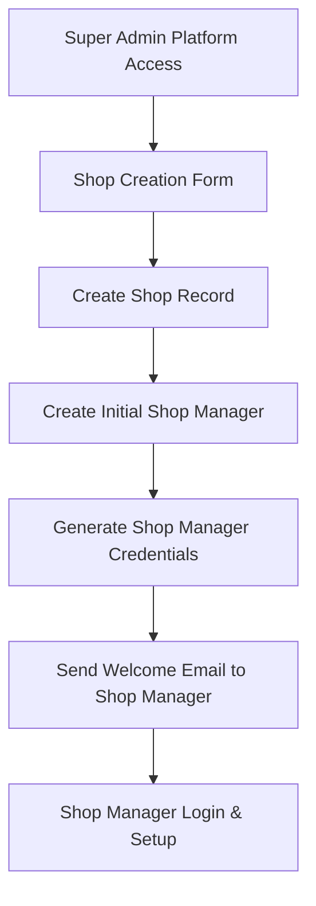
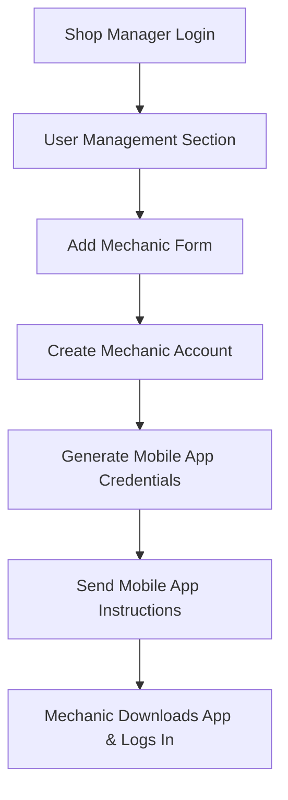
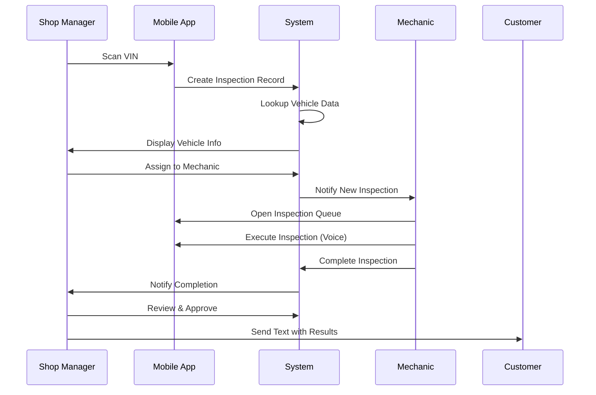
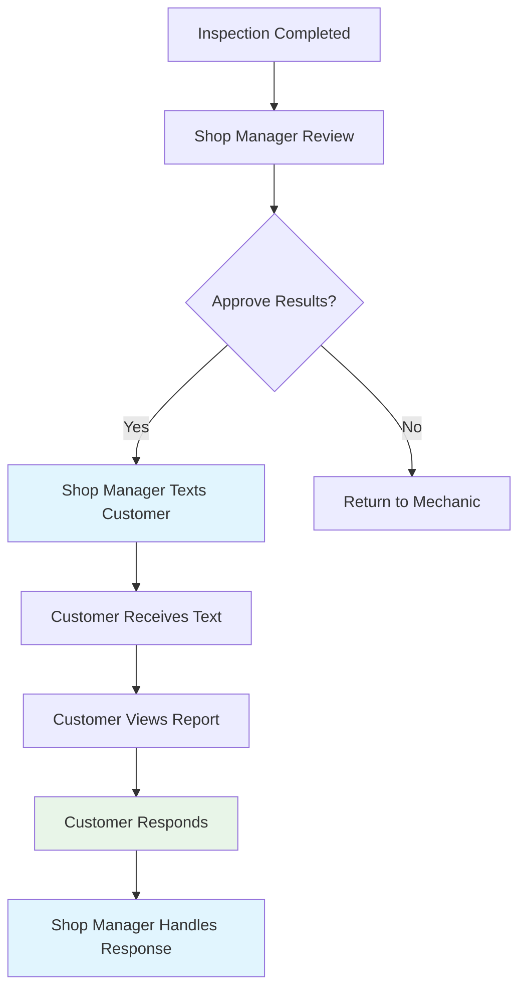

# User Roles and Permissions Specification
## Courtesy Inspection Platform

**Version 1.0 | December 2024**

---

## Executive Summary

This document defines the complete user role hierarchy, permissions matrix, and access control system for the Courtesy Inspection platform. The specification implements a three-tier role system: **Super Admin** (platform founder), **Shop Manager** (multi-role service writer), and **Mechanic** (technician execution only), with clear permission boundaries and workflow definitions.

### Key Design Principles
- **Hierarchical Access**: Super Admin → Shop Manager → Mechanic
- **Functional Separation**: Shop Managers handle customer communication, Mechanics execute inspections only
- **Multi-Role Support**: Shop Managers can perform inspection work while retaining administrative capabilities
- **Platform Control**: Super Admin creates shops and manages platform-wide operations
- **Customer Communication Isolation**: Only Shop Managers can text customers

---

## 1. User Role Hierarchy

### 1.1 Role Definitions

```yaml
super_admin:
  level: 100
  description: "Platform founder with platform-wide control"
  scope: "All shops, platform administration, billing management"
  user_creation: "Creates shops and initial shop managers"
  special_access: "Platform billing, shop creation, system configuration"

shop_manager:
  level: 70
  description: "Service Writer with shop management and inspection capabilities"
  scope: "Single shop operations, customer communication, shop billing"
  user_creation: "Creates mechanics within their shop"
  special_access: "Customer texting, shop billing, VIN scanning, inspection execution"
  alias: "Service Writer"

mechanic:
  level: 30
  description: "Technician with inspection execution only"
  scope: "Inspection queue execution via mobile app"
  user_creation: "None - cannot create users"
  special_access: "Voice-guided inspection execution only"
  restrictions: "NO customer communication, NO billing access"
```

### 1.2 Role Hierarchy Matrix

| Role | Level | Creates | Manages | Platform Access | Customer Contact | Billing |
|------|--------|---------|---------|----------------|------------------|---------|
| **Super Admin** | 100 | Shops, Shop Managers | All shops | Full platform | Via shop context | Platform billing |
| **Shop Manager** | 70 | Mechanics | Single shop | Shop-scoped | Direct texting | Shop billing |
| **Mechanic** | 30 | None | Own work queue | Mobile app only | None | None |

---

## 2. Detailed Permission Matrix

### 2.1 Core System Permissions

```yaml
platform_administration:
  super_admin: ["platform:*"]
  shop_manager: []
  mechanic: []

shop_management:
  super_admin: ["shops:*"]
  shop_manager: ["shops:read", "shops:update"]
  mechanic: []

user_management:
  super_admin: ["users:*"]
  shop_manager: ["mechanics:create", "mechanics:read", "mechanics:update", "mechanics:delete"]
  mechanic: ["users:read_own"]

customer_management:
  super_admin: ["customers:*"]
  shop_manager: ["customers:*"]
  mechanic: ["customers:read"]

vehicle_management:
  super_admin: ["vehicles:*"]
  shop_manager: ["vehicles:*"]
  mechanic: ["vehicles:read"]

inspection_management:
  super_admin: ["inspections:*"]
  shop_manager: ["inspections:*", "vin:scan", "inspections:assign"]
  mechanic: ["inspections:read", "inspections:execute", "inspections:update_status"]

communication:
  super_admin: ["messages:*"]
  shop_manager: ["messages:send", "messages:read", "sms:send"]
  mechanic: []

billing_payments:
  super_admin: ["billing:*", "payments:*", "subscriptions:*"]
  shop_manager: ["shop_billing:read", "shop_billing:update", "payments:process"]
  mechanic: []

mobile_features:
  super_admin: ["mobile:*"]
  shop_manager: ["mobile:*", "vin:scan", "voice:commands"]
  mechanic: ["mobile:inspection_queue", "voice:commands"]

reporting_analytics:
  super_admin: ["reports:*", "analytics:*"]
  shop_manager: ["reports:shop", "analytics:shop"]
  mechanic: []
```

### 2.2 Feature-Specific Permissions

#### VIN Scanning
```yaml
vin_scanning:
  super_admin: true
  shop_manager: true  # Can scan VIN to create inspections
  mechanic: false     # Cannot scan VINs
```

#### Customer Texting (Critical Restriction)
```yaml
customer_texting:
  super_admin: true   # Via shop context
  shop_manager: true  # Direct access
  mechanic: false     # STRICTLY PROHIBITED
```

#### Voice Commands
```yaml
voice_commands:
  super_admin: true
  shop_manager: true  # Can use voice for inspections
  mechanic: true      # Primary interface for inspection execution
```

#### Shop Creation
```yaml
shop_creation:
  super_admin: true   # Only Super Admin creates shops
  shop_manager: false
  mechanic: false
```

---

## 3. User Creation Workflows

### 3.1 Super Admin → Shop Creation



**Process Details:**
1. **Super Admin Access**: Accesses platform admin panel
2. **Shop Creation**: Fills out shop details (name, address, contact info)
3. **Shop Manager Setup**: Creates initial shop manager user
4. **Credential Generation**: System generates secure credentials
5. **Notification**: Shop manager receives setup instructions
6. **Shop Activation**: Shop manager completes setup and shop goes live

### 3.2 Shop Manager → Mechanic Creation



**Process Details:**
1. **Shop Manager Access**: Accesses shop management interface
2. **User Management**: Navigates to team management section
3. **Mechanic Creation**: Fills out mechanic profile information
4. **Account Setup**: System creates mechanic account with restricted permissions
5. **Mobile Credentials**: Generates credentials for mobile app access
6. **App Instructions**: Mechanic receives mobile app setup instructions

### 3.3 Role Assignment Constraints

```yaml
user_creation_constraints:
  super_admin:
    can_create: ["super_admin", "shop_manager"]
    shop_assignment: "any"
    quantity_limits: "unlimited"
    
  shop_manager:
    can_create: ["mechanic"]
    shop_assignment: "own_shop_only"
    quantity_limits: "unlimited_mechanics"
    restrictions: ["cannot_create_shop_managers", "cannot_create_super_admins"]
    
  mechanic:
    can_create: []
    shop_assignment: "none"
    quantity_limits: "none"
```

---

## 4. Interface Access Rules

### 4.1 Web Interface Access

#### Super Admin Web Portal
```yaml
super_admin_web_access:
  url: "https://admin.courtesy-inspection.com"
  features:
    - platform_dashboard
    - shop_management
    - platform_billing
    - system_configuration
    - user_management
    - analytics_platform_wide
    - support_tools
```

#### Shop Manager Web Portal
```yaml
shop_manager_web_access:
  url: "https://app.courtesy-inspection.com"
  features:
    - shop_dashboard
    - customer_management
    - vehicle_management
    - inspection_overview
    - two_way_texting
    - shop_billing
    - team_management
    - reports_analytics
    - settings_shop
```

#### Mechanic Web Access
```yaml
mechanic_web_access:
  url: "https://app.courtesy-inspection.com"
  restrictions: "NO WEB ACCESS"
  alternative: "Mobile app only"
  exception: "Emergency web view for inspection completion (read-only)"
```

### 4.2 Mobile App Access

#### Shop Manager Mobile App
```yaml
shop_manager_mobile:
  full_access: true
  features:
    - vin_scanning
    - inspection_creation
    - inspection_assignment
    - customer_texting
    - inspection_execution
    - voice_commands
    - photo_capture
    - report_review
```

#### Mechanic Mobile App
```yaml
mechanic_mobile:
  restricted_access: true
  features:
    - inspection_queue_view
    - inspection_execution
    - voice_commands
    - photo_capture
    - finding_documentation
  restrictions:
    - no_customer_contact
    - no_billing_access
    - no_user_management
    - no_shop_settings
```

---

## 5. Workflow Definitions

### 5.1 Inspection Creation Workflow



### 5.2 Customer Communication Workflow



### 5.3 User Permission Enforcement

```yaml
permission_enforcement:
  api_level:
    middleware: "role_permission_check"
    validation: "every_request"
    denial_action: "http_403_forbidden"
    
  database_level:
    row_level_security: true
    shop_isolation: "automatic"
    audit_logging: "all_actions"
    
  frontend_level:
    ui_element_hiding: true
    navigation_restriction: true
    feature_availability: "role_based"
```

---

## 6. Database Relationships

### 6.1 User Management Schema

```sql
-- Enhanced users table with role hierarchy
CREATE TABLE users (
    id UUID PRIMARY KEY DEFAULT gen_random_uuid(),
    shop_id UUID REFERENCES shops(id) ON DELETE CASCADE,
    email VARCHAR(255) UNIQUE NOT NULL,
    password_hash VARCHAR(255) NOT NULL,
    role VARCHAR(50) NOT NULL,
    
    -- Role hierarchy validation
    CONSTRAINT valid_role CHECK (
        role IN ('super_admin', 'shop_manager', 'mechanic')
    ),
    
    -- Super admin can belong to multiple shops (NULL shop_id)
    CONSTRAINT shop_assignment CHECK (
        (role = 'super_admin' AND shop_id IS NULL) OR
        (role IN ('shop_manager', 'mechanic') AND shop_id IS NOT NULL)
    )
);

-- Role permissions mapping
CREATE TABLE role_permissions (
    id UUID PRIMARY KEY DEFAULT gen_random_uuid(),
    role VARCHAR(50) NOT NULL,
    permission VARCHAR(100) NOT NULL,
    scope VARCHAR(50) DEFAULT 'shop', -- 'platform', 'shop', 'own'
    
    CONSTRAINT valid_permission_role CHECK (
        role IN ('super_admin', 'shop_manager', 'mechanic')
    ),
    
    UNIQUE(role, permission)
);

-- User creation audit
CREATE TABLE user_creation_audit (
    id UUID PRIMARY KEY DEFAULT gen_random_uuid(),
    created_user_id UUID NOT NULL REFERENCES users(id),
    created_by_user_id UUID NOT NULL REFERENCES users(id),
    shop_id UUID REFERENCES shops(id),
    role_assigned VARCHAR(50) NOT NULL,
    created_at TIMESTAMP WITH TIME ZONE DEFAULT NOW(),
    
    -- Validate creation permissions
    CONSTRAINT valid_creation_hierarchy CHECK (
        -- Super admin can create anyone
        (SELECT role FROM users WHERE id = created_by_user_id) = 'super_admin' OR
        -- Shop manager can only create mechanics in their shop
        ((SELECT role FROM users WHERE id = created_by_user_id) = 'shop_manager' 
         AND role_assigned = 'mechanic'
         AND shop_id = (SELECT shop_id FROM users WHERE id = created_by_user_id))
    )
);
```

### 6.2 Message Access Control

```sql
-- Enhanced messages table with sender restrictions
CREATE TABLE messages (
    id UUID PRIMARY KEY DEFAULT gen_random_uuid(),
    customer_id UUID NOT NULL REFERENCES customers(id),
    shop_id UUID NOT NULL REFERENCES shops(id),
    user_id UUID REFERENCES users(id), -- Who sent the message
    direction VARCHAR(20) NOT NULL,
    type VARCHAR(20) NOT NULL DEFAULT 'sms',
    content TEXT NOT NULL,
    
    -- Only shop managers can send messages
    CONSTRAINT sender_permission CHECK (
        direction = 'inbound' OR 
        (direction = 'outbound' AND 
         (SELECT role FROM users WHERE id = user_id) IN ('super_admin', 'shop_manager'))
    )
);
```

### 6.3 Shop Access Control

```sql
-- Shop access permissions
CREATE TABLE shop_user_permissions (
    id UUID PRIMARY KEY DEFAULT gen_random_uuid(),
    shop_id UUID NOT NULL REFERENCES shops(id),
    user_id UUID NOT NULL REFERENCES users(id),
    granted_by UUID NOT NULL REFERENCES users(id),
    granted_at TIMESTAMP WITH TIME ZONE DEFAULT NOW(),
    
    -- Validate permission granting
    CONSTRAINT valid_permission_granter CHECK (
        (SELECT role FROM users WHERE id = granted_by) IN ('super_admin', 'shop_manager')
    ),
    
    UNIQUE(shop_id, user_id)
);
```

---

## 7. API Access Controls

### 7.1 Authentication Middleware

```javascript
// Role-based authentication middleware
const authenticateRole = (requiredRoles) => {
  return async (req, res, next) => {
    try {
      const token = req.headers.authorization?.replace('Bearer ', '');
      const decoded = jwt.verify(token, process.env.JWT_SECRET);
      
      const user = await User.findById(decoded.sub);
      if (!user || !requiredRoles.includes(user.role)) {
        return res.status(403).json({ 
          error: 'Insufficient permissions',
          required: requiredRoles,
          current: user?.role 
        });
      }
      
      req.user = user;
      req.permissions = await getUserPermissions(user);
      next();
    } catch (error) {
      return res.status(401).json({ error: 'Invalid authentication' });
    }
  };
};

// Permission-specific middleware
const requirePermission = (permission) => {
  return (req, res, next) => {
    if (!req.permissions.includes(permission) && !req.permissions.includes('*')) {
      return res.status(403).json({
        error: 'Missing required permission',
        required: permission,
        available: req.permissions
      });
    }
    next();
  };
};
```

### 7.2 Route Protection Examples

```javascript
// Super Admin only routes
app.post('/api/shops', 
  authenticateRole(['super_admin']),
  requirePermission('shops:create'),
  createShop
);

// Shop Manager routes
app.post('/api/customers/:customerId/messages',
  authenticateRole(['super_admin', 'shop_manager']),
  requirePermission('messages:send'),
  validateShopAccess,
  sendCustomerMessage
);

// Mechanic accessible routes
app.get('/api/inspections/queue',
  authenticateRole(['super_admin', 'shop_manager', 'mechanic']),
  requirePermission('inspections:read'),
  getInspectionQueue
);

// Mixed access with role-specific logic
app.put('/api/inspections/:id',
  authenticateRole(['super_admin', 'shop_manager', 'mechanic']),
  (req, res, next) => {
    // Mechanics can only update status, not details
    if (req.user.role === 'mechanic') {
      const allowedFields = ['status', 'completed_at', 'findings'];
      const updateFields = Object.keys(req.body);
      
      if (!updateFields.every(field => allowedFields.includes(field))) {
        return res.status(403).json({
          error: 'Mechanics can only update inspection status and findings'
        });
      }
    }
    next();
  },
  updateInspection
);
```

### 7.3 Shop Isolation Middleware

```javascript
// Ensure users can only access their shop's data
const enforceShopIsolation = async (req, res, next) => {
  if (req.user.role === 'super_admin') {
    // Super admin can access any shop
    return next();
  }
  
  const shopId = req.params.shopId || req.body.shopId || req.query.shopId;
  
  if (shopId && shopId !== req.user.shopId) {
    return res.status(403).json({
      error: 'Access denied: cannot access other shop data'
    });
  }
  
  // Inject shop context for database queries
  req.shopContext = req.user.shopId;
  next();
};
```

---

## 8. Session Management

### 8.1 Role-Specific Session Configuration

```javascript
const sessionConfig = {
  super_admin: {
    maxAge: 8 * 60 * 60 * 1000, // 8 hours
    secure: true,
    httpOnly: true,
    sameSite: 'strict',
    rolling: true
  },
  
  shop_manager: {
    maxAge: 12 * 60 * 60 * 1000, // 12 hours
    secure: true,
    httpOnly: true,
    sameSite: 'strict',
    rolling: true
  },
  
  mechanic: {
    maxAge: 8 * 60 * 60 * 1000, // 8 hours
    secure: true,
    httpOnly: true,
    sameSite: 'strict',
    rolling: false // Fixed session for mobile stability
  }
};

// Apply role-specific session settings
const configureSession = (user) => {
  return session({
    ...sessionConfig[user.role],
    name: `courtesy_${user.role}_session`,
    secret: process.env.SESSION_SECRET,
    store: new MongoStore({
      mongoUrl: process.env.MONGODB_URL,
      touchAfter: user.role === 'mechanic' ? 0 : 24 * 3600
    })
  });
};
```

### 8.2 Multi-Role Session Handling

```javascript
// Handle shop managers who may also work as mechanics
const handleMultiRoleAccess = (req, res, next) => {
  if (req.user.role === 'shop_manager') {
    // Shop managers get both roles' permissions
    req.effectiveRoles = ['shop_manager', 'mechanic'];
    req.permissions = [
      ...getPermissions('shop_manager'),
      ...getPermissions('mechanic')
    ];
  } else {
    req.effectiveRoles = [req.user.role];
    req.permissions = getPermissions(req.user.role);
  }
  next();
};
```

---

## 9. Mobile App View Differences

### 9.1 Shop Manager Mobile Interface

```yaml
shop_manager_mobile_ui:
  dashboard:
    - inspection_overview
    - customer_messages
    - shop_performance
    - team_activity
    
  primary_actions:
    - scan_vin
    - create_inspection
    - text_customer
    - review_completed_work
    
  navigation:
    - customers
    - inspections
    - messages
    - team
    - reports
    - settings
    
  inspection_flow:
    - can_create_new
    - can_assign_to_mechanics
    - can_execute_personally
    - can_review_and_approve
    - can_send_to_customer
```

### 9.2 Mechanic Mobile Interface

```yaml
mechanic_mobile_ui:
  dashboard:
    - assigned_inspections_queue
    - current_inspection_progress
    - completed_today_count
    
  primary_actions:
    - start_next_inspection
    - continue_current_inspection
    - voice_command_input
    - capture_photos
    
  navigation:
    - inspection_queue
    - current_inspection
    - profile
    
  inspection_flow:
    - cannot_create_new
    - cannot_assign_to_others
    - can_execute_assigned
    - cannot_review_others_work
    - cannot_send_to_customer
    
  restrictions:
    hidden_ui_elements:
      - customer_contact_info
      - messaging_features
      - billing_information
      - user_management
      - shop_settings
```

### 9.3 Interface Customization Logic

```javascript
// Mobile app UI configuration based on role
const getUIConfig = (userRole) => {
  const baseConfig = {
    theme: 'courtesy_inspection',
    voice_enabled: true,
    offline_capable: true
  };
  
  switch (userRole) {
    case 'shop_manager':
      return {
        ...baseConfig,
        features: {
          vin_scanning: true,
          customer_messaging: true,
          user_management: true,
          billing_access: true,
          inspection_assignment: true,
          shop_settings: true
        },
        navigation: [
          'dashboard', 'customers', 'inspections', 
          'messages', 'team', 'reports', 'settings'
        ]
      };
      
    case 'mechanic':
      return {
        ...baseConfig,
        features: {
          vin_scanning: false,
          customer_messaging: false,
          user_management: false,
          billing_access: false,
          inspection_assignment: false,
          shop_settings: false
        },
        navigation: [
          'inspection_queue', 'current_inspection', 'profile'
        ],
        restricted_mode: true
      };
      
    default:
      throw new Error(`Unsupported role: ${userRole}`);
  }
};
```

---

## 10. Multi-Role Handling

### 10.1 Shop Manager as Owner/Manager/Mechanic Hybrid

```yaml
hybrid_role_scenarios:
  owner_manager:
    description: "Shop owner who also manages day-to-day operations"
    permissions: "Full shop_manager permissions"
    billing_access: "Enhanced (owner-level financial access)"
    
  manager_mechanic:
    description: "Service writer who also performs inspections"
    permissions: "shop_manager + mechanic execution capabilities"
    workflow: "Can assign work to others OR execute personally"
    
  owner_manager_mechanic:
    description: "Solo shop owner who does everything"
    permissions: "All shop_manager permissions"
    workflow: "Complete end-to-end inspection process"
```

### 10.2 Permission Inheritance Logic

```javascript
// Handle hybrid roles and permission inheritance
class PermissionManager {
  static getEffectivePermissions(user) {
    let permissions = new Set();
    
    // Base role permissions
    permissions = new Set([...permissions, ...this.getRolePermissions(user.role)]);
    
    // Shop managers get mechanic permissions for execution
    if (user.role === 'shop_manager') {
      const mechanicPermissions = this.getRolePermissions('mechanic');
      permissions = new Set([...permissions, ...mechanicPermissions]);
    }
    
    // Owner-specific enhancements
    if (user.isOwner) {
      permissions.add('billing:advanced');
      permissions.add('shop:delete');
      permissions.add('users:full_access');
    }
    
    return Array.from(permissions);
  }
  
  static canPerformAction(user, action, context = {}) {
    const permissions = this.getEffectivePermissions(user);
    
    // Check direct permission
    if (permissions.includes(action) || permissions.includes('*')) {
      return true;
    }
    
    // Check wildcard permissions
    const actionParts = action.split(':');
    const wildcardPermission = `${actionParts[0]}:*`;
    
    if (permissions.includes(wildcardPermission)) {
      return true;
    }
    
    // Role-specific logic
    switch (user.role) {
      case 'shop_manager':
        // Shop managers can do anything within their shop
        return context.shopId === user.shopId;
        
      case 'mechanic':
        // Mechanics can only work on assigned inspections
        if (action.startsWith('inspections:')) {
          return context.assignedTechnicianId === user.id;
        }
        return false;
        
      default:
        return false;
    }
  }
}
```

### 10.3 Multiple Shop Managers per Shop

```yaml
multiple_shop_managers:
  allowed: true
  max_count: "unlimited"
  creation_permission: "super_admin or existing shop_manager"
  
  scenarios:
    service_advisors:
      count: "multiple"
      specialization: "customer_communication, scheduling"
      
    shift_managers:
      count: "multiple"
      specialization: "different_shifts, coverage"
      
    department_managers:
      count: "multiple"
      specialization: "different_service_areas"
```

---

## 11. Security Implementation

### 11.1 Permission Validation Pipeline

```javascript
// Multi-layer permission validation
const validatePermissions = async (req, res, next) => {
  try {
    // Layer 1: Authentication check
    if (!req.user) {
      return res.status(401).json({ error: 'Authentication required' });
    }
    
    // Layer 2: Role validation
    const requiredRoles = req.route.meta?.roles;
    if (requiredRoles && !requiredRoles.includes(req.user.role)) {
      return res.status(403).json({ 
        error: 'Insufficient role level',
        required: requiredRoles,
        current: req.user.role
      });
    }
    
    // Layer 3: Permission check
    const requiredPermission = req.route.meta?.permission;
    if (requiredPermission) {
      const hasPermission = await PermissionManager.canPerformAction(
        req.user, 
        requiredPermission, 
        req.context
      );
      
      if (!hasPermission) {
        return res.status(403).json({
          error: 'Missing required permission',
          required: requiredPermission
        });
      }
    }
    
    // Layer 4: Shop isolation (for non-super-admin)
    if (req.user.role !== 'super_admin') {
      await enforceShopIsolation(req, res, next);
    } else {
      next();
    }
    
  } catch (error) {
    return res.status(500).json({ error: 'Permission validation failed' });
  }
};
```

### 11.2 Audit Logging

```javascript
// Comprehensive audit logging for user actions
const auditUserAction = async (req, res, next) => {
  const startTime = Date.now();
  
  // Capture original end method
  const originalEnd = res.end;
  
  res.end = function(chunk, encoding) {
    const duration = Date.now() - startTime;
    
    // Log the action
    logUserAction({
      userId: req.user?.id,
      userRole: req.user?.role,
      shopId: req.user?.shopId,
      action: `${req.method} ${req.path}`,
      parameters: sanitizeLogData(req.body),
      statusCode: res.statusCode,
      duration,
      ipAddress: req.ip,
      userAgent: req.get('User-Agent'),
      timestamp: new Date()
    });
    
    // Call original end method
    originalEnd.call(this, chunk, encoding);
  };
  
  next();
};

const sanitizeLogData = (data) => {
  const sensitive = ['password', 'token', 'secret', 'key'];
  const sanitized = { ...data };
  
  Object.keys(sanitized).forEach(key => {
    if (sensitive.some(s => key.toLowerCase().includes(s))) {
      sanitized[key] = '[REDACTED]';
    }
  });
  
  return sanitized;
};
```

---

## 12. Error Handling and Edge Cases

### 12.1 Permission Denied Scenarios

```javascript
// Graceful permission denial handling
const handlePermissionError = (error, req, res, next) => {
  if (error.type === 'PERMISSION_DENIED') {
    const response = {
      error: 'Access denied',
      code: 'INSUFFICIENT_PERMISSIONS',
      details: {
        required: error.required,
        current: error.current,
        resource: error.resource
      }
    };
    
    // Role-specific error messages
    switch (req.user?.role) {
      case 'mechanic':
        response.message = 'This feature is not available for technicians. Please contact your shop manager.';
        break;
      case 'shop_manager':
        response.message = 'This feature requires super admin access. Please contact support.';
        break;
      default:
        response.message = 'You do not have permission to access this resource.';
    }
    
    return res.status(403).json(response);
  }
  
  next(error);
};
```

### 12.2 Role Transition Handling

```javascript
// Handle role changes (promotions/demotions)
const handleRoleChange = async (userId, newRole, changedBy) => {
  const transaction = await db.beginTransaction();
  
  try {
    // Validate role change permissions
    const changer = await User.findById(changedBy);
    const target = await User.findById(userId);
    
    if (!canChangeRole(changer, target, newRole)) {
      throw new Error('Insufficient permissions to change role');
    }
    
    // Update user role
    await User.updateRole(userId, newRole, { transaction });
    
    // Invalidate existing sessions
    await SessionManager.invalidateUserSessions(userId);
    
    // Log role change
    await AuditLog.create({
      action: 'ROLE_CHANGE',
      userId: userId,
      changedBy: changedBy,
      oldRole: target.role,
      newRole: newRole,
      timestamp: new Date()
    }, { transaction });
    
    // Send notification to user
    await NotificationService.sendRoleChangeNotification(userId, newRole);
    
    await transaction.commit();
    
  } catch (error) {
    await transaction.rollback();
    throw error;
  }
};

const canChangeRole = (changer, target, newRole) => {
  // Super admin can change any role
  if (changer.role === 'super_admin') {
    return true;
  }
  
  // Shop managers can only change mechanic roles within their shop
  if (changer.role === 'shop_manager') {
    return target.shopId === changer.shopId && 
           target.role === 'mechanic' && 
           newRole === 'mechanic';
  }
  
  return false;
};
```

---

## 13. Implementation Checklist

### 13.1 Backend Implementation Tasks

```yaml
authentication_system:
  - [ ] JWT token generation with role claims
  - [ ] Role-based middleware implementation
  - [ ] Session management by role
  - [ ] Password reset with role validation

authorization_system:
  - [ ] Permission matrix database tables
  - [ ] Role permission validation middleware
  - [ ] Shop isolation enforcement
  - [ ] API endpoint protection

user_management:
  - [ ] User creation workflows
  - [ ] Role assignment validation
  - [ ] Multi-role permission inheritance
  - [ ] User deactivation procedures

audit_compliance:
  - [ ] Action logging system
  - [ ] Permission change tracking
  - [ ] Login/logout monitoring
  - [ ] Failed access attempt logging
```

### 13.2 Frontend Implementation Tasks

```yaml
web_interface:
  - [ ] Role-based navigation menus
  - [ ] Feature visibility controls
  - [ ] Permission-based UI elements
  - [ ] Error handling for denied access

mobile_interface:
  - [ ] Role-specific app configurations
  - [ ] Mechanic restricted interface
  - [ ] Shop manager full interface
  - [ ] Offline permission caching

user_experience:
  - [ ] Clear permission error messages
  - [ ] Role identification in UI
  - [ ] Feature accessibility indicators
  - [ ] Help documentation by role
```

### 13.3 Testing Requirements

```yaml
security_testing:
  - [ ] Role escalation prevention
  - [ ] Shop isolation verification
  - [ ] Permission bypass attempts
  - [ ] Cross-shop data access prevention

functional_testing:
  - [ ] User creation workflows
  - [ ] Permission inheritance testing
  - [ ] Multi-role scenario testing
  - [ ] Error handling verification

integration_testing:
  - [ ] Mobile app permission sync
  - [ ] Web interface role consistency
  - [ ] Database constraint validation
  - [ ] API endpoint security
```

---

## Conclusion

This specification provides a comprehensive role-based access control system that implements the founder's requirements:

### ✅ **Core Requirements Met**
- **Three-tier hierarchy**: Super Admin → Shop Manager → Mechanic
- **Shop creation control**: Only Super Admin creates shops
- **Customer communication isolation**: Only Shop Managers can text customers
- **Mechanic restrictions**: Inspection execution only, no customer contact
- **Multi-role support**: Shop Managers can perform inspection work
- **VIN scanning access**: Shop Managers only

### 🛡️ **Security Features**
- **Role-based permissions**: Granular permission matrix
- **Shop isolation**: Strict data separation between shops
- **Audit logging**: Complete action tracking
- **Session management**: Role-specific session configurations
- **Permission validation**: Multi-layer security checks

### 📱 **Platform Integration**
- **Mobile app differences**: Role-specific interfaces
- **Web portal access**: Appropriate feature visibility
- **Workflow enforcement**: Proper inspection assignment and communication flows
- **Database relationships**: Secure user and permission management

The system ensures that mechanics focus solely on inspection execution while shop managers handle all customer communication and administrative tasks, maintaining clear separation of responsibilities while supporting the hybrid roles common in automotive service environments.

---

**Document Version**: 1.0  
**Last Updated**: December 2024  
**Status**: Ready for Implementation  
**Technical Contact**: tech@courtesyinspection.com